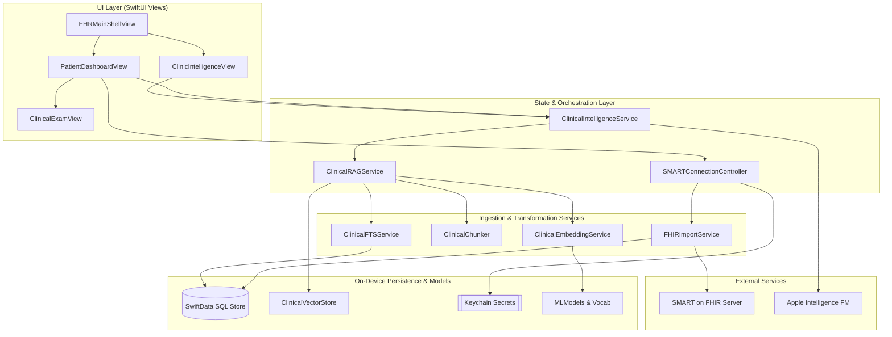
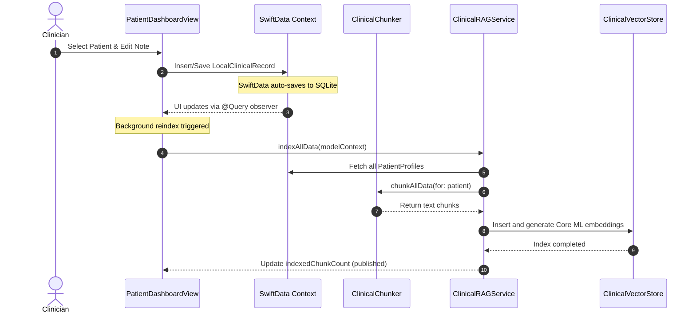
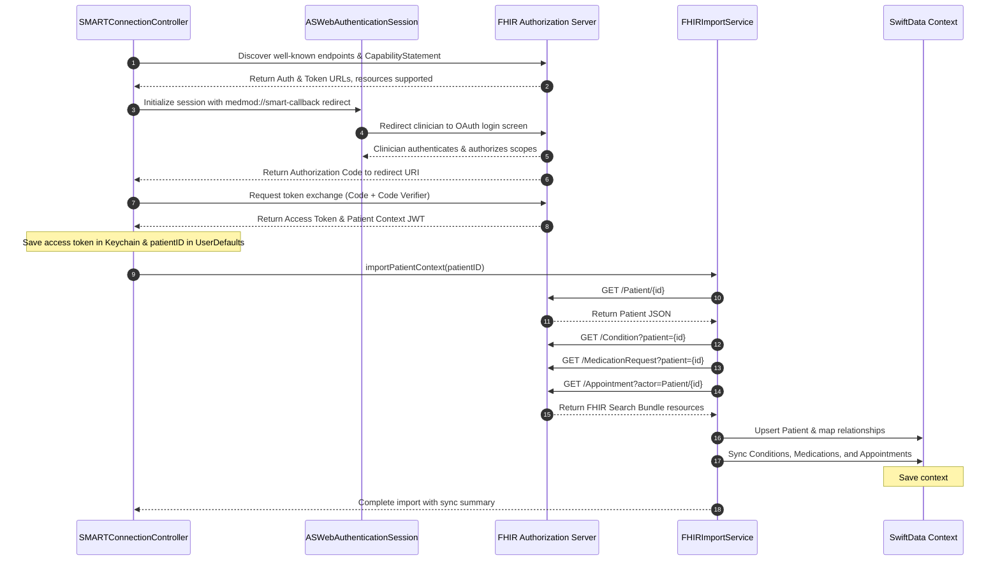
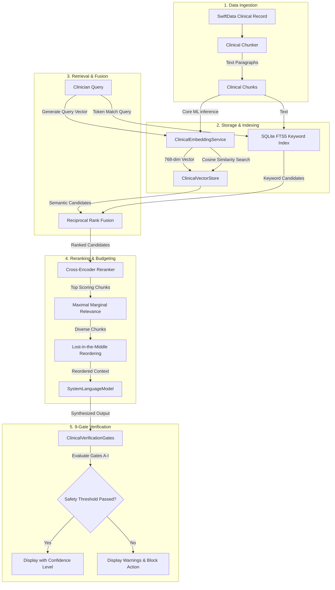

# Architectural Deep Dive: OpenClinic

OpenClinic is designed as a standalone, Apple-native clinical workstation for healthcare providers. This document outlines the core architectural principles, layer responsibilities, state management models, concurrency guarantees, and system designs that drive the application.

---

## 1. Architectural Thesis

Traditional Electronic Health Record (EHR) systems are built as database-centric web portals that suffer from high latency, poor offline capabilities, and complex UI layouts. OpenClinic proposes an alternative: **a local-first, Apple-native, intelligence-augmented client**. 

The design rests on three pillars:
1. **Low Latency & Offline Autonomy:** Clinical work happens in high-stress, variable-connectivity environments. The application stores and queries clinical records locally using SwiftData and custom indexes, allowing workflow completion without internet access.
2. **Contextual On-Device AI:** Rather than sending sensitive Patient Health Information (PHI) to cloud-based LLM endpoints, the app leverages Apple's on-device Foundation Models for clinical summarization, structured documentation generation, and Q&A.
3. **Traceable Interoperability:** Data imported from external EHR systems via SMART on FHIR is never flattened; it retains clear provenance metadata to expose its origin, sync timestamp, and authority level.

---

## 2. System Layer Diagram

This diagram displays the detailed connections between the SwiftUI views, the background orchestration services, local storage components, and the on-device inference model.

---

## 3. Layer-by-Layer Breakdown

### UI / View Layer
OpenClinic's UI is written entirely in SwiftUI, optimized for multi-column split views on iPadOS and macOS Catalyst. 
* **Views** are designed to be stateless observers of environment properties and SwiftData query descriptors. They bind user actions (e.g. initiating voice dictation, requesting chart summaries) directly to orchestration services.
* **ClinicDesignSystem:** (Located in [ClinicDesignSystem.swift](OpenClinic/Views/ClinicDesignSystem.swift)) Dictates color palettes, typography styling, and component styling (e.g. status banners, patient demographic banners, and provenance badge colors).

### State & Orchestration Layer
Orchestrators are implemented as `@MainActor` singletons or state objects that bridge SwiftUI views with low-level data processors.
* **`SMARTConnectionController`:** Manages OAuth 2.0 connection state, in-app ASWebAuthentication sessions, token persistence, and import triggering.
* **`ClinicalIntelligenceService`:** Manages the active patient session lifecycle, prompt compilation, token budget compliance, and fallback generation flows.
* **`ClinicalRAGService`:** Coordinates the multi-step indexing, hybrid search, reciprocal rank fusion, and response verification steps.

### Ingestion & Processing Layer
This layer handles the parsing, transformation, and vector indexing of clinical resources.
* **`FHIRImportService`:** Pulls raw JSON data for Patient, Condition, MedicationRequest, and Appointment resources from external servers and updates the SwiftData context.
* **`ClinicalChunker`:** Segregates patient profiles, clinical histories, and medications into standardized text chunks, enriching each chunk with metadata.
* **`ClinicalEmbeddingService`:** Houses the natural language tokenizer vocabulary and Core ML models to generate high-dimensional vectors on-device.

### Persistence & Storage Layer
* **SwiftData:** The primary object graph persistence layer. It maps patient entities, appointments, records, and clinical photos, automatically persisting data to SQLite.
* **`ClinicalVectorStore`:** An actor-isolated store that handles flat vector database searches and serializes the float arrays to the app's local sandbox container.
* **Keychain:** Protects OAuth access tokens and credentials.

---

## 4. State Management Model

OpenClinic utilizes SwiftUI's native state bindings and SwiftData query observers to manage UI rendering:

1. **Local Persistent State:** SwiftData handles automatic object tracking. The `@Query` property wrapper in SwiftUI views automatically monitors data changes and refreshes layouts.
2. **Global Controller State:** `SMARTConnectionController` and `ClinicalIntelligenceService` conform to `ObservableObject`, exposing their status (e.g., `isImporting`, `thinkingSteps`) via `@Published` properties.
3. **Session Switching:** When a clinician changes patients, `resetSessions()` is called, wiping conversational caches and resetting token budgets to avoid patient cross-contamination.

---

## 5. Data Model Overview

The primary SwiftData models are configured in `OpenClinic/Models/`:

* **`PatientProfile`:** Contains demographic details (MRN, DOB, gender), emergency contact data, and array relationships to medications, clinical records, and appointments.
* **`LocalClinicalRecord`:** Stores clinical encounter notes, HPI details, review of systems, physical exam findings, impressions, and ICD-10 diagnostic codes. Uses a signature field for state tracking (`Draft` $\rightarrow$ `Reviewed` $\rightarrow$ `Signed`).
* **`LocalMedication`:** Maps medication requests, dosages, routes, refill counts, and prescription status.
* **`Appointment`:** Represents scheduled slots, reasons for visit, and clinical workflow status (`Scheduled`, `Checked In`, `In Exam`, `Ready for Checkout`, `Completed`).
* **`ClinicalPhoto`:** Stores clinical images, lesion tracking logs, and coordinates mapping to the 3D body grid.

All clinical models inherit a standardized **Provenance Model** structure:
* `sourceKind`: Enum mapping data origin (e.g. `smartOnFhir`, `clinicianCaptured`, `localAI`).
* `sourceSystemName`: Identifier of the originating system.
* `sourceRecordIdentifier`: Native key on the remote EHR server.
* `sourceLastSyncedAt`: Date of sync.
* `sourceOfTruth`: Boolean indicating if the remote server overrides local changes.

---

## 6. SMART on FHIR API Integration Map

The OAuth 2.0 exchange and FHIR synchronization map as follows:

---

## 7. Core Retrieval (RAG) Pipeline

OpenClinic implements a local hybrid RAG pipeline that compiles indexed content, scores candidates using Reciprocal Rank Fusion, and validates outputs through safety gates.

### Detailed Pipeline Breakdown
1. **Ingestion:** Clinical records are parsed by the `ClinicalChunker`, separating sections like history (HPI), physical findings, and plans, while appending patient scope markers.
2. **Indexing:** Chunks are concurrently stored in an FTS5 full-text index for lexical recall and compiled into 768-dimensional float arrays via Core ML for vector similarity.
3. **Retrieval & Fusion:** The query is routed to FTS5 and the Core ML embedding evaluator. The search rankings are combined via Reciprocal Rank Fusion ($k=60$).
4. **Reranking:** The `ClinicalRAGEngine` runs candidate lists through a cross-encoder and filters redundancies via MMR before reordering context elements to avoid attention degradation.
5. **9-Gate Verification:** Runs checks evaluating retrieval confidence, coverage, number grounding, contradictions, and patient scope boundaries.

---

## 8. Concurrency Model

OpenClinic enforces strict actor isolation and asynchronous task scheduling to maintain a 120 FPS UI target:
* **`@MainActor` Isolation:** Applied to all views, UI state controllers (`SMARTConnectionController`), and the `ClinicalIntelligenceService` to ensure UI state modifications occur strictly on the main thread.
* **Global Actor Isolation:** Subsystem indices (such as vector database search and SQLite index inserts) are separated using task context switches. Embedding batches are compiled on background threads before being packaged.
* **Structured Tasks:** RAG reindexing and SMART sync operations are wrapped in Structured Concurrency scopes (`Task { ... }`). The main app loop listens for URL callbacks and handles them on task-isolated threads.

---

## 9. Error Handling Model

The application follows a structured, type-safe error management approach:
* **`SMARTConnectionControllerError`:** Standardizes connectivity errors (such as state mismatch, missing credentials, or discovery failure) and provides localized user-facing alerts.
* **Resilient Sync Pipelines:** During SMART sync, the import parser uses a `resilientBundleFetch` wrapper. If one FHIR resource fetch fails (e.g., a server does not support `AllergyIntolerance`), the system logs a warning, skips the resource, and continues parsing the remaining data categories, avoiding complete sync failures.
* **RAG Fallback Path:** If Apple Intelligence or Core ML indexing fails, the RAG query pipeline automatically switches to a localized heuristic lookup wrapper, extracting text fragments based on static category filters without crashing the UI.

---

## 10. Observability & Logging Model

Subsystem activities are logged using Apple's unified logging system via `os.Logger`. Subsystem categories are defined in [AppLogger.swift](OpenClinic/AppLogger.swift):

* `App`: Launch operations, database migrations, and schema issues.
* `Data`: Mock data seeding and database operations.
* `SMART`: Discovery URLs, OAuth handshakes, and resource sync.
* `AI`: Token budgets, vector search times, and verification results.
* `Exam`: Clinical workspace actions, note signing, and PDF exports.

Log statements use private privacy boundaries (e.g., `\(patient.fullName, privacy: .private)`) to ensure PHI and other sensitive credentials never appear in plain-text system logs or device logs.

---

## 11. Architectural Tradeoffs

1. **Launch-time RAG Reindexing:** The application reindexes all patient files on every app launch. While fast for prototype scopes (~200 chunks take less than 1.5 seconds), a production EHR environment will require delta-based background indexing.
2. **Import-Only FHIR Pipeline:** The current FHIR service is import-only. Outbound changes (like newly signed notes or updated medication requests) stay local and are not written back to the EHR server, leaving writeback as a future capability.
3. **Flat Vector Index:** The vector store uses a flat array-based linear scan for cosine similarity. This keeps dependencies minimal, but must be migrated to an HNSW or SQLite-based vector extension for panel databases exceeding 10,000 chunks.

---

## 12. Extension Points

* **Spatial visionOS Views:** The views under `OpenClinic/Views/AnatomicalRealityView.swift` are designed to display 2D body maps. These can be extended to use native visionOS RealityKit anchors for interactive 3D anatomy tracking.
* **Outbound Sync Handlers:** `FHIRImportService` can be extended with `FHIRExportService` to submit POST requests containing signed clinical documents formatted as FHIR `DocumentReference` resources.
* **Custom LLM Connectors:** The general `SystemLanguageModel` implementation inside `ClinicalIntelligenceService` can be adapted to plug in remote endpoints (e.g., self-hosted HIPAA-compliant private servers) when local devices lack Apple Intelligence hardware.
