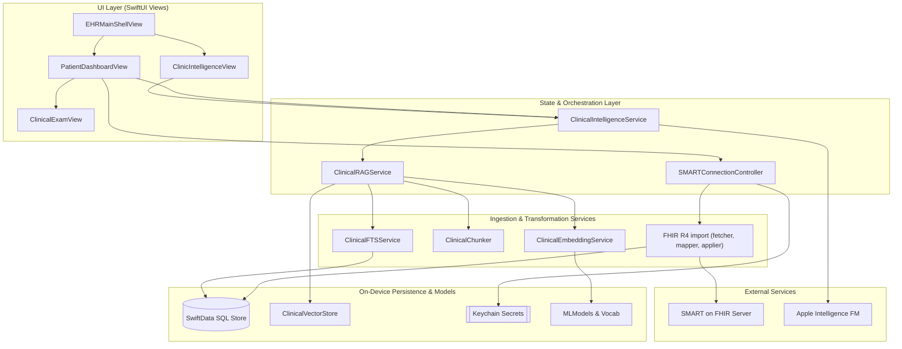
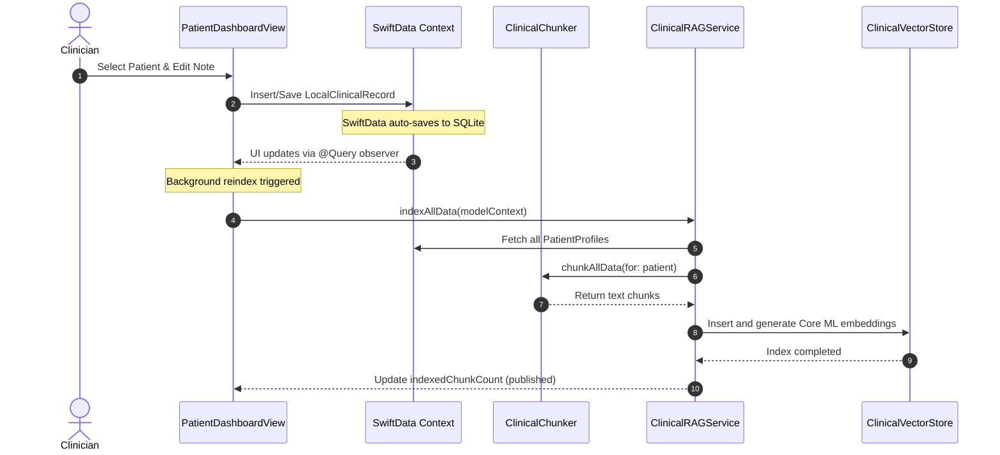
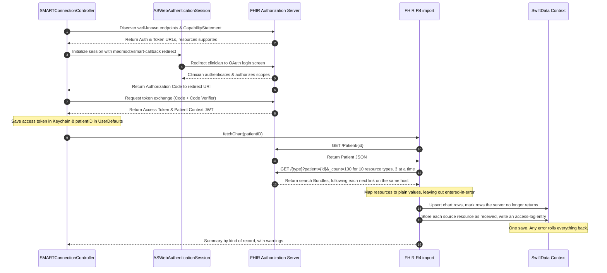
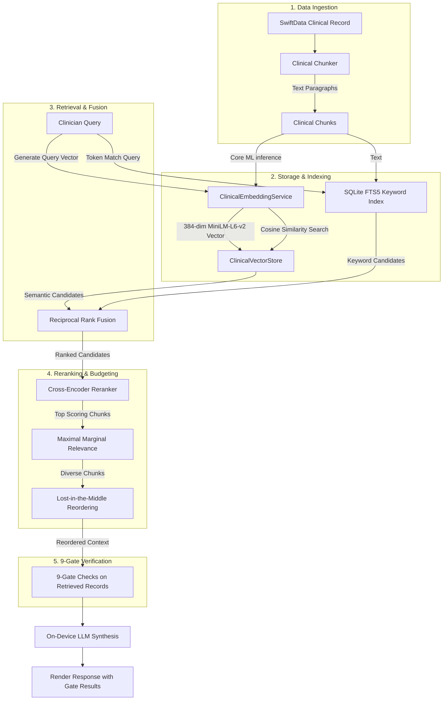

# Architectural Deep Dive: OpenClinic

OpenClinic is designed as an Apple-native clinical workstation prototype for healthcare providers. This document outlines the core architectural principles, layer responsibilities, state management models, concurrency guarantees, and system designs that drive the application.

---

## 1. Architectural Thesis

Traditional Electronic Health Record (EHR) systems are built as database-centric web portals that suffer from high latency, poor offline capabilities, and complex UI layouts. OpenClinic proposes an alternative: **a local-first, Apple-native, intelligence-augmented client**. 

The design rests on four pillars:
1. **Low Latency & Offline Autonomy:** Clinical work happens in high-stress, variable-connectivity environments. The application stores and queries clinical records locally using SwiftData and custom indexes, allowing workflow completion without internet access.
2. **Contextual On-Device AI:** Rather than sending sensitive Patient Health Information (PHI) to cloud-based LLM endpoints, the app leverages Apple's on-device Foundation Models for clinical summarization, structured documentation generation, and Q&A.
3. **Traceable Interoperability:** Data imported from external EHR systems via SMART on FHIR is never flattened; it retains clear provenance metadata to expose its origin, sync timestamp, and authority level.
4. **OpenIntelligence-Derived Retrieval Core:** The clinical retrieval stack borrows and adapts proven OpenIntelligence patterns for embeddings, FTS, retrieval shaping, and verification, then narrows them to patient-scoped clinical safety requirements.

---

## 2. System Layer Diagram

This diagram displays the detailed connections between the SwiftUI views, the background orchestration services, local storage components, and the on-device inference model.

```mermaid
flowchart TD
    subgraph UI ["UI Layer (SwiftUI Views)"]
        View[EHRMainShellView]
        PatientView[PatientDashboardView]
        ExamView[ClinicalExamView]
        ChatView[ClinicIntelligenceView]
    end

    subgraph Controller ["State & Orchestration Layer"]
        SMARTCtrl[SMARTConnectionController]
        IntelSvc[ClinicalIntelligenceService]
        RAGSvc[ClinicalRAGService]
    end

    subgraph DataService ["Ingestion & Transformation Services"]
        FHIRSvc["FHIR R4 import (fetcher, mapper, applier)"]
        Chunker[ClinicalChunker]
        EmbedSvc[ClinicalEmbeddingService]
        FTSSvc[ClinicalFTSService]
    end

    subgraph Storage ["On-Device Persistence & Models"]
        SD[(SwiftData SQL Store)]
        VecDB[ClinicalVectorStore]
        Keychain[[Keychain Secrets]]
        CoreML[MLModels & Vocab]
    end

    subgraph External ["External Services"]
        FHIRServer[SMART on FHIR Server]
        FoundationModel[Apple Intelligence FM]
    end

    %% UI Connections
    View --> PatientView & ChatView
    PatientView --> ExamView
    PatientView & ChatView --> IntelSvc
    PatientView --> SMARTCtrl

    %% Controller Connections
    SMARTCtrl --> FHIRSvc
    IntelSvc --> RAGSvc
    RAGSvc --> Chunker & EmbedSvc & FTSSvc

    %% Service to Storage / External Connections
    FHIRSvc --> FHIRServer
    FHIRSvc --> SD
    SMARTCtrl --> Keychain
    EmbedSvc --> CoreML
    FTSSvc --> SD
    RAGSvc --> VecDB
    IntelSvc --> FoundationModel
```

---

## 3. Layer-by-Layer Breakdown

### UI / View Layer
OpenClinic's UI is written entirely in SwiftUI, optimized for multi-column split views on iPadOS and macOS. 
* **Views** are designed to be stateless observers of environment properties and SwiftData query descriptors. They bind user actions (e.g. initiating voice dictation, requesting chart summaries) directly to orchestration services.
* **ClinicDesignSystem:** (Located in [ClinicDesignSystem.swift](OpenClinic/Views/ClinicDesignSystem.swift)) Dictates color palettes, typography styling, and component styling (e.g. status banners, patient demographic banners, and provenance badge colors).

### State & Orchestration Layer
Orchestrators are implemented as `@MainActor` singletons or state objects that bridge SwiftUI views with low-level data processors.
* **`SMARTConnectionController`:** Manages OAuth 2.0 connection state, in-app ASWebAuthentication sessions, token persistence, and import triggering.
* **`ClinicalIntelligenceService`:** Manages the active patient session lifecycle, prompt compilation, token budget compliance, and fallback generation flows.
* **`ClinicalRAGService`:** Coordinates the multi-step indexing, hybrid search, reciprocal rank fusion, and response verification steps.

### Ingestion & Processing Layer
This layer handles the parsing, transformation, and vector indexing of clinical resources.
* **`FHIRR4Client`, `FHIRR4ChartFetcher`, `FHIRR4ChartMapper`, `ChartImportApplier`:** Read a patient's record from a FHIR R4 server, map it to plain values, and apply it to the SwiftData context. Section 6 describes the split.
* **`ClinicalChunker`:** Segregates patient profiles, clinical histories, and medications into standardized text chunks, enriching each chunk with metadata.
* **`ClinicalEmbeddingService`:** Houses the natural language tokenizer vocabulary and Core ML models to generate high-dimensional vectors on-device. Portions of this stack are explicitly adapted from OpenIntelligence's embedding pipeline.

### Persistence & Storage Layer
* **SwiftData:** The primary object graph persistence layer. It maps patient entities, appointments, records, and clinical photos, automatically persisting data to SQLite.
* **`ClinicalVectorStore`:** An actor-isolated store that handles flat vector database searches and serializes the float arrays to the app's local sandbox container.
* **Keychain:** Protects OAuth access tokens and credentials.

---

## 4. State Management Model

OpenClinic utilizes SwiftUI's native state bindings and SwiftData query observers to manage UI rendering:

```mermaid
sequenceDiagram
    autonumber
    actor Clinician
    participant View as PatientDashboardView
    participant DB as SwiftData Context
    participant Chunker as ClinicalChunker
    participant RAG as ClinicalRAGService
    participant VecDB as ClinicalVectorStore

    Clinician->>View: Select Patient & Edit Note
    View->>DB: Insert/Save LocalClinicalRecord
    Note over DB: SwiftData auto-saves to SQLite
    DB-->>View: UI updates via @Query observer
    
    Note over View: Background reindex triggered
    View->>RAG: indexAllData(modelContext)
    RAG->>DB: Fetch all PatientProfiles
    RAG->>Chunker: chunkAllData(for: patient)
    Chunker-->>RAG: Return text chunks
    RAG->>VecDB: Insert and generate Core ML embeddings
    VecDB-->>RAG: Index completed
    RAG-->>View: Update indexedChunkCount (published)
```

1. **Local Persistent State:** SwiftData handles automatic object tracking. The `@Query` property wrapper in SwiftUI views automatically monitors data changes and refreshes layouts.
2. **Global Controller State:** `SMARTConnectionController` and `ClinicalIntelligenceService` conform to `ObservableObject`, exposing their status (e.g., `isImporting`, `thinkingSteps`) via `@Published` properties.
3. **Session Switching:** When a clinician changes patients, `resetSessions()` is called, wiping conversational caches and resetting token budgets to avoid patient cross-contamination.

---

## 5. Data Model Overview

The primary SwiftData models are configured in `OpenClinic/Models/`:

* **`PatientProfile`:** Contains demographic details (MRN, DOB, gender), emergency contact data, and array relationships to medications, clinical records, and appointments.
* **`LocalClinicalRecord`:** Stores clinical encounter notes, HPI details, review of systems, physical exam findings, impressions, and ICD-10 diagnostic codes. Uses a signature field for state tracking (`Draft` $\rightarrow$ `Reviewed` $\rightarrow$ `Signed`).
* **`LocalMedication`:** Maps medication requests, dosages, routes, refill counts, and prescription status.
* **`Appointment`:** Represents scheduled slots, reasons for visit, and clinical workflow status (`Scheduled`, `Checked In`, `In Exam`, `Ready for Checkout`, `Completed`).
* **`ClinicalPhoto`:** Stores clinical images, lesion tracking logs, and coordinates mapping to the 3D body grid.
* **`ChartProblem`, `ChartAllergy`, `ChartObservation`, `ChartEncounter`, `ChartProcedure`, `ChartImmunization`, `ChartDiagnosticReport`, `ChartDocument`:** The structured chart, one model per FHIR resource type it mirrors. Vital signs and laboratory results are `ChartObservation` rows; a value on screen always comes from one. Each row has `isRemovedAtSource`, set when a later import no longer returns it.
* **`FHIRResourceRecord`:** Each imported resource exactly as the server sent it, keyed the same way as the chart row mapped from it, so any imported value can be traced to its source JSON.
* **`AuditEvent`:** The access log. It records the action and the identifier of the record touched, never clinical content.

`OpenClinicSchema` lists every model once. The app, the App Intents, and the tests all build their container from it, and `StoreBootstrap` moves an unreadable store aside instead of deleting it.

All clinical models inherit a standardized **Provenance Model** structure:
* `sourceKind`: Enum mapping data origin (e.g. `smartOnFhir`, `clinicianCaptured`, `localAI`).
* `sourceSystemName`: Identifier of the originating system.
* `sourceRecordIdentifier`: Native key on the remote EHR server.
* `sourceLastSyncedAt`: Date of sync.
* `sourceOfTruth`: Boolean indicating if the remote server overrides local changes.

---

## 6. SMART on FHIR API Integration Map

The OAuth 2.0 exchange and FHIR synchronization map as follows:

```mermaid
sequenceDiagram
    autonumber
    participant UI as SMARTConnectionController
    participant Auth as ASWebAuthenticationSession
    participant Server as FHIR Authorization Server
    participant Sync as FHIR R4 import
    participant DB as SwiftData Context

    UI->>Server: Discover well-known endpoints & CapabilityStatement
    Server-->>UI: Return Auth & Token URLs, resources supported
    UI->>Auth: Initialize session with medmod://smart-callback redirect
    Auth->>Server: Redirect clinician to OAuth login screen
    Server-->>Auth: Clinician authenticates & authorizes scopes
    Server-->>UI: Return Authorization Code to redirect URI
    UI->>Server: Request token exchange (Code + Code Verifier)
    Server-->>UI: Return Access Token & Patient Context JWT
    Note over UI: Save access token in Keychain & patientID in UserDefaults
    
    UI->>Sync: fetchChart(patientID)
    Sync->>Server: GET /Patient/{id}
    Server-->>Sync: Return Patient JSON
    Sync->>Server: GET /{type}?patient={id}&_count=100 for 10 resource types, 3 at a time
    Server-->>Sync: Return search Bundles, following each next link on the same host
    Note over Sync: Map resources to plain values, leaving out entered-in-error
    Sync->>DB: Upsert chart rows, mark rows the server no longer returns
    Sync->>DB: Store each source resource as received, write an access-log entry
    Note over DB: One save. Any error rolls everything back.
    Sync-->>UI: Summary by kind of record, with warnings
```

In this diagram `Sync` is three types. `FHIRR4Client` is the HTTP layer: paging, one retry with a fresh token after a 401, backoff on 429 and 5xx with `Retry-After`, and a refusal to follow a paging link to another host so a bearer token is never sent off the server it was issued for. `FHIRR4ChartMapper` is pure: it turns raw resources into `ImportedChart` values and reports what it left out. `ChartImportApplier` writes those values to SwiftData. A resource type whose search failed or hit the page limit is recorded in `failedTypes` or `truncatedTypes`, and the applier leaves that type's existing rows exactly as they were.

The ten types read for a patient are Condition, MedicationRequest, AllergyIntolerance, Observation, Encounter, Procedure, Immunization, DiagnosticReport, DocumentReference, and Appointment. The open SMART Health IT sandbox (`https://r4.smarthealthit.org`) needs no token, so `SandboxImportView` can import a synthetic patient without the OAuth flow.

---

## 7. Core Retrieval (RAG) Pipeline

OpenClinic implements a local hybrid RAG pipeline that compiles indexed content, scores candidates using Reciprocal Rank Fusion, and checks the retrieved records through safety gates before the model runs.

```mermaid
flowchart TD
    subgraph Ingestion ["1. Data Ingestion"]
        Record[SwiftData Clinical Record] --> Chunker[Clinical Chunker]
        Chunker -->|Text Paragraphs| Chunks[Clinical Chunks]
    end

    subgraph Indexing ["2. Storage & Indexing"]
        Chunks -->|Text| FTS5[SQLite FTS5 Keyword Index]
        Chunks -->|Core ML inference| Embedder[ClinicalEmbeddingService]
        Embedder -->|384-dim MiniLM-L6-v2 Vector| VecDB[ClinicalVectorStore]
    end

    subgraph Retrieval ["3. Retrieval & Fusion"]
        Query[Clinician Query] -->|Generate Query Vector| Embedder
        Embedder -->|Cosine Similarity Search| VecDB
        Query -->|Token Match Query| FTS5
        VecDB -->|Semantic Candidates| RRF[Reciprocal Rank Fusion]
        FTS5 -->|Keyword Candidates| RRF
    end

    subgraph Processing ["4. Reranking & Budgeting"]
        RRF -->|Ranked Candidates| Rerank[Cross-Encoder Reranker]
        Rerank -->|Top Scoring Chunks| MMR[Maximal Marginal Relevance]
        MMR -->|Diverse Chunks| Middle[Lost-in-the-Middle Reordering]
    end

    subgraph Verification ["5. 9-Gate Verification"]
        Middle -->|Reordered Context| GateEval[9-Gate Checks on Retrieved Records]
    end

    GateEval --> LLM[On-Device LLM Synthesis] --> Output[Render Response with Gate Results]
```

### Detailed Pipeline Breakdown
1. **Ingestion:** Clinical records are parsed by the `ClinicalChunker`, separating sections like history (HPI), physical findings, and plans, while appending patient scope markers.
2. **Indexing:** Chunks are concurrently stored in an FTS5 full-text index for lexical recall and compiled into 384-dimensional embeddings (MiniLM-L6-v2) via Core ML for vector similarity.
3. **Retrieval & Fusion:** The query is routed to FTS5 and the Core ML embedding evaluator. The search rankings are combined via Reciprocal Rank Fusion ($k=60$).
4. **Reranking:** The `ClinicalRAGEngine` runs candidate lists through a cross-encoder and filters redundancies via MMR before reordering context elements to avoid attention degradation.
5. **Retrieval Checks:** Nine checks score the assembled context for retrieval confidence, contradictions, and patient scope boundaries. As built they run before generation and do not read the model's answer; the app labels model-written answers as unchecked.

### Computed Panel Answers
A set question ("which patients have melanoma history", "who is on biologics or immunosuppressants") has one correct answer, so it does not go through the pipeline above. `CohortQueryParser` turns the question into a structured query against a lexicon of diagnosis concepts (name terms and ICD-10 prefixes), drug classes, risk concepts, and the medications and allergens charted in the panel. `CohortEngine` evaluates the query over a `PanelSnapshot`, a value copy of the chart facts, and returns each matching patient with the record, prescription, or appointment that matched. The parser is strict: a negation or any content word it does not understand makes it return nil, and the question falls through to retrieval and the model.

---

## 8. Concurrency Model

OpenClinic enforces strict actor isolation and asynchronous task scheduling to maintain a 120 FPS UI target:
* **`@MainActor` Isolation:** Applied to all views, UI state controllers (`SMARTConnectionController`), and the `ClinicalIntelligenceService` to ensure UI state modifications occur strictly on the main thread.
* **Global Actor Isolation:** Subsystem indices (such as vector database search and SQLite index inserts) are separated using task context switches. Tokenization and pooling for an embedding run on the main actor, which is the target's default isolation; the Core ML prediction between them is awaited off it. In an 8 second sample taken during a reindex in the iOS 27.0 Simulator on 2026-10-07, the main thread was busy 2.3% of the time.
* **Structured Tasks:** RAG reindexing and SMART sync operations are wrapped in Structured Concurrency scopes (`Task { ... }`). The main app loop listens for URL callbacks and handles them on task-isolated threads.

## 8.5. Product Boundary

OpenClinic should be described as a clinical workspace prototype, not a production EHR replacement and not a live deployment target. The architecture is intentionally serious about PHI boundaries and workflow realism, but the repository does not claim production compliance, outbound writeback readiness, or operational hardening for real-world deployment.

---

## 9. Error Handling Model

The application follows a structured, type-safe error management approach:
* **`SMARTConnectionControllerError`:** Standardizes connectivity errors (such as state mismatch, missing credentials, or discovery failure) and provides localized user-facing alerts.
* **Resilient Sync Pipelines:** If one resource type's search fails (for example a server that does not support `AllergyIntolerance`), the fetcher records the type in `failedTypes`, adds a warning the clinician sees, and continues with the other types. Only a failed Patient read stops the import.
* **RAG Fallback Path:** If Apple Intelligence or Core ML indexing fails, the RAG query pipeline automatically switches to a localized heuristic lookup wrapper, extracting text fragments based on static category filters without crashing the UI.

---

## 10. Observability & Logging Model

Subsystem activities are logged using Apple's unified logging system via `os.Logger`. Subsystem categories are defined in [AppLogger.swift](OpenClinic/AppLogger.swift):

* `App`: Launch operations, database migrations, and schema issues.
* `Data`: Mock data seeding and database operations.
* `SMART`: Discovery URLs, OAuth handshakes, and resource sync.
* `AI`: Token budgets, vector search times, and verification results.
* `Exam`: Clinical workspace actions, note signing, and PDF exports.

Log statements carry no privacy annotations; interpolated strings such as patient names are not marked public, so the system redacts them by default.

---

## 11. Architectural Tradeoffs

1. **Launch-time RAG Reindexing:** The application reindexes all patient files on every app launch. Measured in the iOS 27.0 Simulator on 2026-10-07: 291 chunks in 55 s and 568 chunks in 71 s; it has not been timed on a device. A record import re-indexes only the imported patient (47 chunks in 7.2 s in the same simulator). A production EHR environment will require delta-based background indexing for edits as well.
2. **Import-Only FHIR Pipeline:** The FHIR layer is import-only. Outbound changes (like newly signed notes or updated medication requests) stay local and are not written back to the EHR server, leaving writeback as a future capability.
3. **Flat Vector Index:** The vector store uses a flat array-based linear scan for cosine similarity. This keeps dependencies minimal, but must be migrated to an HNSW or SQLite-based vector extension for panel databases exceeding 10,000 chunks.

---

## 12. Extension Points

* **Spatial visionOS Views:** The views under `OpenClinic/Views/AnatomicalRealityView.swift` are designed to display 2D body maps. These can be extended to use native visionOS RealityKit anchors for interactive 3D anatomy tracking.
* **Outbound Sync Handlers:** `FHIRR4Client` reads only. Writing a signed note back as a FHIR `DocumentReference` needs a create method on the client and a mapper in the other direction.
* **Custom LLM Connectors:** The general `SystemLanguageModel` implementation inside `ClinicalIntelligenceService` can be adapted to plug in remote endpoints (e.g., self-hosted HIPAA-compliant private servers) when local devices lack Apple Intelligence hardware.
