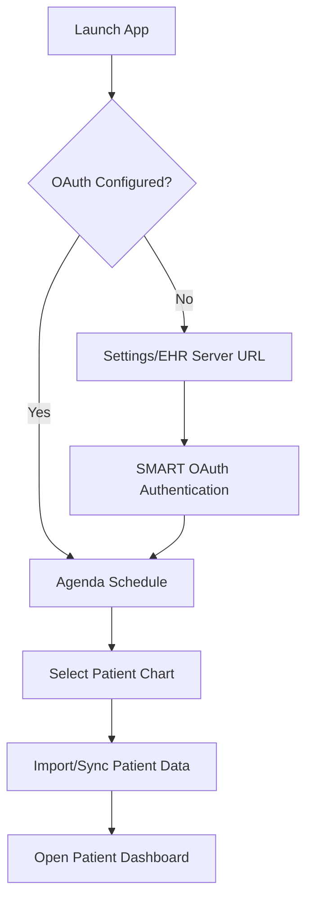
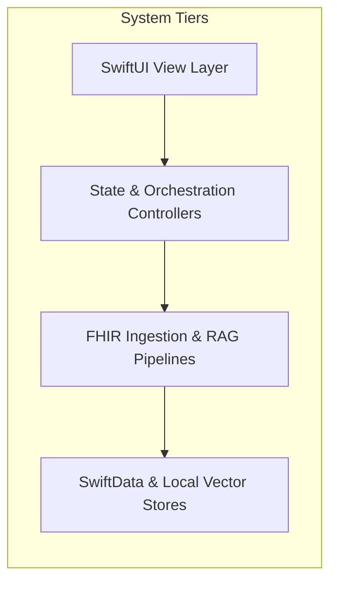
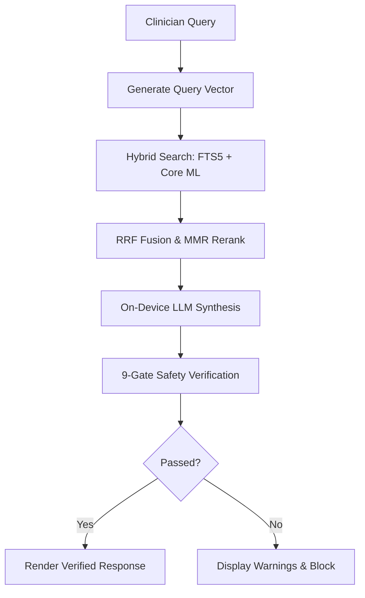
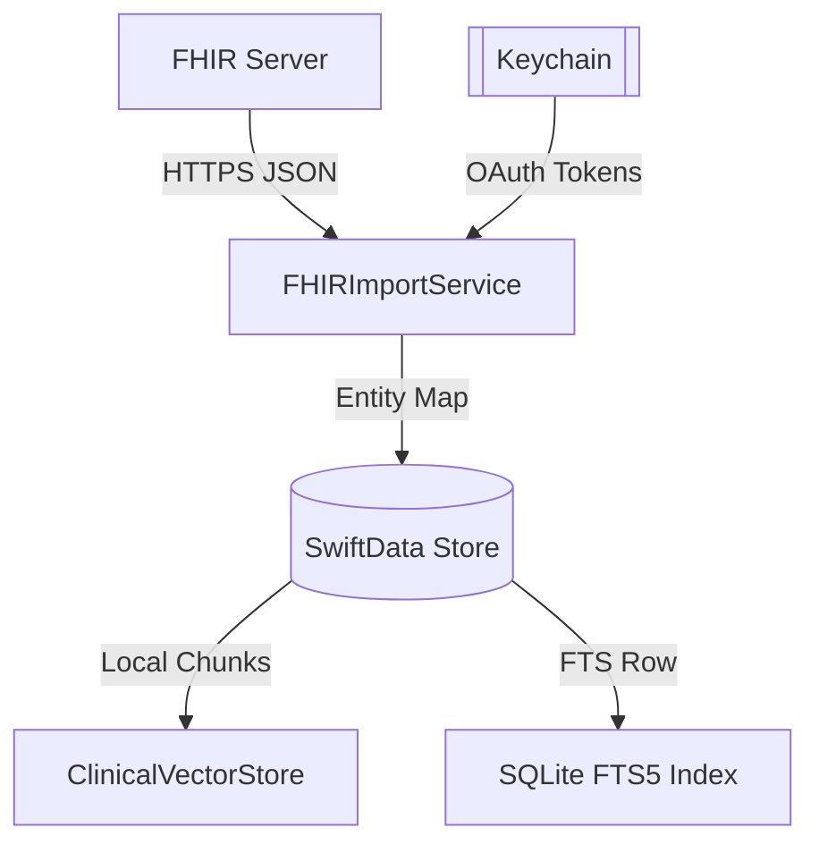

# OpenClinic

<p align="center">
  
</p>

<p align="center">
  <strong>A provider-facing clinical workspace prototype for patient charting, SMART on FHIR import, and on-device clinical intelligence.</strong>
</p>

<p align="center">
  
  
  
</p>

---

## Overview

OpenClinic is a native iOS, iPadOS, macOS, and visionOS clinical workspace designed for healthcare providers. It integrates patient schedules, clinical record logs, visual timelines for dermatological checkups, and a SMART on FHIR synchronization pipeline into a unified SwiftUI experience that keeps chart state local on device.

* **Functional Role:** Aggregates patient demographic profiles, clinical record timelines, medication lists, appointments, and photos.
* **Clinician Workflow:** Provides offline-capable charting, record lookups, and note completion tools while keeping PHI inside the device sandbox except when explicitly pulling records from configured SMART on FHIR servers.
* **On-Device LLMs & RAG:** Implements a local retrieval-augmented generation (RAG) pipeline to support chart Q&A, clinical note compilation, and documentation checks without transmitting Patient Health Information (PHI) to third-party cloud APIs.
* **Engine Lineage:** The clinical retrieval stack adapts OpenIntelligence internals for Core ML embeddings, token budgeting, retrieval shaping, and verification, then specializes those paths for patient-scoped clinical use.
* **EHR Integration:** Connects to standard EHR sandbox platforms using SMART on FHIR OAuth scopes to import multi-patient records.
* **Product Boundary:** OpenClinic is a prototype and design exploration. It is not approved for live clinical deployment and should not be presented as a production EHR replacement.

---

## Product Snapshot

| Dimension | Detail |
|---|---|
| Platform | iOS / iPadOS / macOS Catalyst / visionOS |
| Language | Swift |
| UI | SwiftUI |
| Architecture | Container-driven / Actor-isolated RAG |
| Primary APIs | Apple Foundation Models (`LanguageModelSession`), SMART on FHIR, Core ML |
| Storage | SwiftData, SQLite FTS5, Keychain |
| Status | Prototype |
| License | Proprietary / None |

---

## Key Capabilities

- **On-Device LLM Integration:** Binds to local Apple Foundation Models (`LanguageModelSession`) to transcribe dictations into structured notes (`ClinicalVisitNote`).
- **Local Vector Search:** Generates 768-dimensional embeddings using a bundled Core ML model, indexing chunks in a local vector database.
- **9-Gate Verification:** Runs post-processing safety checks (evaluating evidence coverage, numeric sanity, contradictions, and patient data boundaries) before displaying generated text.
- **FHIR Interoperability:** Uses `ASWebAuthenticationSession` to authorize and sync Patient, Condition, MedicationRequest, and Appointment resources.
- **Data Provenance:** Attaches sync timestamps and source system attributes to SwiftData entities to preserve the authority of remote records.
- **OpenIntelligence-Derived Retrieval Internals:** Reuses and adapts embedding, full-text, boosting, and verification patterns from OpenIntelligence, but applies them to patient-scoped clinical workflows instead of general document Q&A.
- **Main-Thread Concurrency:** Isolates database inserts, vector queries, and full-text indexing inside background Actors.

---

## How It Works

This flowchart details the clinician onboarding, patient navigation, and database sync workflow:



On launch, OpenClinic seeds a baseline configuration and sets up the local SwiftData model container. Clinicians select patients from a daily schedule timeline. If connected to a SMART on FHIR server, the client queries and resolves patient records locally on demand.

---

## Architecture

OpenClinic organizes components into distinct functional layers:



*For a detailed view-by-view diagram covering controllers, services, and local file storage, refer to [ARCHITECTURE.md](ARCHITECTURE.md#2-system-layer-diagram).*

---

## Core Workflows

The RAG query engine processes clinician inputs using a hybrid vector-lexical lookup and output validator:



*For details on chunking parameters, cross-encoders, and reciprocal rank fusion, refer to [ARCHITECTURE.md](ARCHITECTURE.md#7-core-retrieval-rag-pipeline).*

---

## Data Flow

This diagram traces the local storage boundaries and data synchronization paths:



---

## File Entry Points

| Concern | Files | Responsibility |
|---|---|---|
| **App Entry** | [OpenClinicApp.swift](OpenClinic/OpenClinicApp.swift) | Bootstrapping the SwiftData schema, UserDefaults migrations, and launch-time RAG index triggers. |
| **Main UI Shell** | [ContentView.swift](OpenClinic/ContentView.swift) | Coordinates first-run mock data seeding and configures the rolling schedule timeline. |
| **Patient Chart UI** | [PatientDashboardView.swift](OpenClinic/Views/PatientDashboardView.swift) | Primary clinical layout displaying demographics, visit history, medication lists, and visual timelines. |
| **Encounter Workspace** | [ClinicalExamView.swift](OpenClinic/Views/ClinicalExamView.swift) | Dictation transcription and structured note generation interface for clinicians. |
| **Intelligence UI** | [ClinicIntelligenceView.swift](OpenClinic/Views/ClinicIntelligenceView.swift) | Console UI for executing patient-specific or panel-wide local AI queries. |
| **OAuth Connection** | [SMARTConnectionController.swift](OpenClinic/Interop/SMART/SMARTConnectionController.swift) | Handles authorization endpoint discovery, JWT decoding, and token renewal. |
| **FHIR Sync Ingestion** | [FHIRImportService.swift](OpenClinic/Interop/FHIR/FHIRImportService.swift) | Connects to external endpoints to pull and parse Patient, Condition, and Medication resources. |
| **RAG Orchestrator** | [ClinicalRAGService.swift](OpenClinic/RAG/ClinicalRAGService.swift) | Coordinates embeddings, FTS5 keywords, hybrid rankings, and verification gates. |
| **Response Validation** | [VerificationGates.swift](OpenClinic/RAG/VerificationGates.swift) | Implements the 9-gate safety validator evaluating grounding, completeness, and HIPAA isolation. |

---

## Configuration

These environment configurations control OpenClinic's local storage and sync behavior:

| Setting | Storage | Default | Required | Purpose |
|---|---|---|---|---|
| **EHR Server Presets** | `UserDefaults` | `https://launch.smarthealthit.org/v/r4/fhir` | Yes | Endpoint base URL for SMART discovery and patient downloads. |
| **SMART Client ID** | `UserDefaults` | `medmod-ios-public` | Yes | Public application registration identifier on the EHR server. |
| **Redirect Scheme** | `Info.plist` | `medmod://smart-callback` | Yes | Callback schema mapping for ASWebAuthenticationSession redirection. |
| **RAG Embedding Model** | Local Directory | `EmbeddingModel.mlpackage` | Yes | Core ML package path for text embedding generation. |
| **Token Vocabulary** | Local Directory | `embedding_vocab.json` | Yes | Token mapping file for the clinical text chunker. |
| **First Launch Seeded** | `UserDefaults` | `didClearLegacyDataV1` | No | Tracks if legacy duplicates have been wiped and seed dataset written. |

---

## Build & Run

### Prerequisite Toolchain
* macOS 27.0+ or compatible development workstation.
* **Xcode 26.3** with iOS 26.2, macOS 27.0, and visionOS 26.2 SDKs installed.
* Apple Developer Account configured in Xcode for physical device testing.

### Setup Instructions
```bash
# Clone the repository
git clone https://github.com/Gunnarguy/OpenClinic.git
cd OpenClinic

# Open the project in Xcode
open OpenClinic.xcodeproj
```

1. Select the `OpenClinic` target in the scheme editor.
2. Under **Signing & Capabilities**, select your developer team and update the bundle identifier if compiling for a physical device.
3. Choose a simulator (e.g. iPad Pro running iOS 26.2) or select a connected Apple device.
4. Press `Cmd + R` to compile and run. On launch, the app will seed clinical demo records and start the local vector indexer.

---

## Testing

Verification relies on manual flow checks and diagnostic logging.

| Validation | Command / Procedure | Expected Result |
|---|---|---|
| **Build Target Check** | `xcodebuild -project OpenClinic.xcodeproj -scheme OpenClinic -sdk iphonesimulator build` | Compilation succeeds without errors or warnings. |
| **Local Seeding Test** | Clean install app on simulator, inspect UI | Patient lists (Doe, Santos, Chen) load immediately; logs show "🌱 First launch detected". |
| **SMART Sandbox Sync** | Settings -> Live EHR Import -> SMART R4 Preset -> Connect | SMART sandbox sign-in sheet appears, authenticates, and imports data without crash. |
| **RAG Indexing Test** | Launch app, check Console logs | Logs show "📊 Reindex complete: X chunks, Y FTS rows". |
| **AI Verification Test** | Ask a panel question in Intelligence tab | Result outputs with green shield for "High" grounding, or red warnings for failed gates. |

---

## Privacy & Security

OpenClinic runs as a closed system on the doctor's device. No clinical data is synced to third-party databases:
* **Encryption at Rest:** SwiftData sqlite files inherit default Apple sandbox encryption.
* **Credentials Storage:** SMART tokens, client secrets, and session parameters are kept in the OS Keychain.
* **Log Privacy:** System log statements (`os.Logger`) redact patient names and medical record numbers.

For more details, see [PRIVACY.md](PRIVACY.md) and [SECURITY.md](SECURITY.md).

---

## Documentation

| Document | Purpose |
|---|---|
| [Architecture](ARCHITECTURE.md) | System design, data flow, and service boundaries |
| [Security](SECURITY.md) | Secret handling, local storage, and release checks |
| [Privacy](PRIVACY.md) | Data storage, API transmission, and user controls |
| [Roadmap](ROADMAP.md) | Current status, planned work, and known gaps |
| [Case Study](docs/CASE_STUDY.md) | Engineering retrospective and implementation notes |

---

## Roadmap

### Completed Milestones
- [x] SwiftData core models mapping patient charts, clinical notes, medications.
- [x] On-device vector store and SQLite FTS5 search indexers.
- [x] 9-Gate verification pipeline evaluating RAG outputs for clinical correctness.
- [x] SMART on FHIR OAuth discovery and patient record import flows.
- [x] Reciprocal Rank Fusion (RRF) and MMR search candidate balancing.
- [x] Multi-platform UI Unification and macOS Catalyst Support.
- [x] Integration of RAG Evaluation and XCTest Suites.

### In Progress
- [ ] Enhancing multi-pass Deep Think query extraction heuristics.
- [ ] Optimizing Core ML inference times on older Apple Silicon devices.
- [ ] Transitioning visionOS build targets to spatial multi-window environments.

### Planned / Backlog
- [ ] Outbound writebacks to FHIR servers (e.g. uploading signed notes).
- [ ] Full-body anatomical mesh mapping in 3D for spatial tracking.

---

## License

No license has been applied to this repository yet. Contact the repository owner before copying, modifying, or redistributing these source materials.
