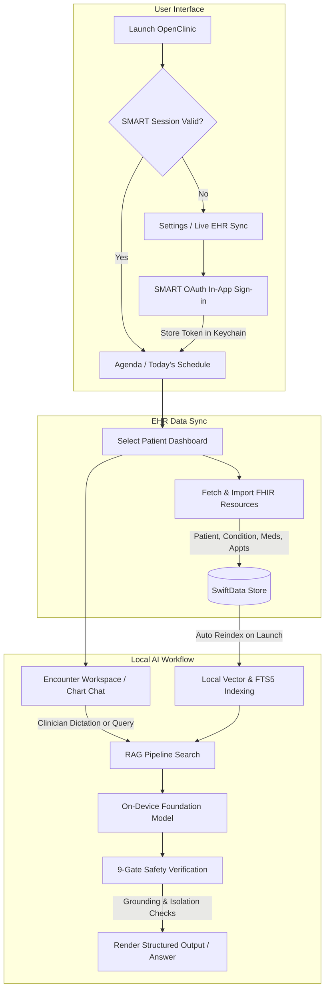
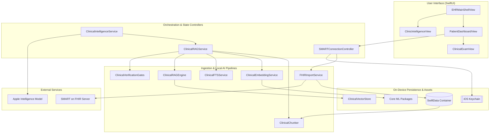
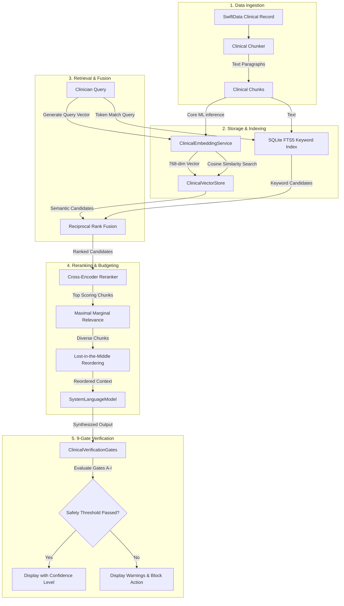

# OpenClinic

<p align="center">
  
</p>

<p align="center">
  <strong>A provider-facing, local-first clinical workspace for patient charting, encounter documentation, and on-device clinical intelligence.</strong>
</p>

<p align="center">
  
  
  
  
  
</p>

## Overview

**OpenClinic** is an advanced, Apple-native clinical workstation designed for healthcare providers (HCPs). It integrates patient schedule management, clinical record tracking, dermatology-focused visual timelines, and a SMART on FHIR interoperability pipeline into a unified, local-first SwiftUI experience.

* **What the app is:** A native iPad, iPhone, macOS, and visionOS workspace that aggregates patient demographics, clinical records, medications, appointments, and photos.
* **Who it is for:** Healthcare practitioners (physicians, dermatologists, and nurses) looking for an responsive, offline-capable alternative to traditional web-wrapped Electronic Health Record (EHR) systems.
* **What problem it solves:** Eliminates latency, internet-dependency, and generic text editors in clinical workflows by using on-device ML for dictation transcription, structured note generation, and semantic chart querying.
* **Why it is technically interesting:** It runs a complete, local RAG (Retrieval-Augmented Generation) pipeline directly on the client. It features a custom chunking parser, local tokenizers, Core ML vector embeddings, SQLite FTS5 lexical indexing, reciprocal rank fusion (RRF), and a strict **9-gate clinical verification pipeline** to guarantee data safety.
* **What makes it different:** Unlike patient-facing health apps that utilize the device owner's HealthKit sandbox, OpenClinic is a provider-facing app that imports multi-patient data directly from EHR systems using SMART on FHIR authorization and scopes.

---

## Product Snapshot

| Dimension | Detail |
|---|---|
| **Platform** | iOS 26.2+ / iPadOS 26.2+ / macOS Catalyst 26.2+ / visionOS 26.2+ |
| **Language** | Swift (Swift 6 Concurrency and Structured Concurrency) |
| **UI** | SwiftUI (with native multi-column navigation and custom Design System tokens) |
| **Architecture** | Container-driven state with Service-orchestrated RAG pipelines |
| **Primary APIs** | Apple Foundation Models (`LanguageModelSession`), SMART on FHIR, Core ML |
| **Storage** | SwiftData local persistence, SQLite FTS5 for search indexing, Keychain for secrets |
| **Status** | Serious Prototype / Active Architecture Playground |
| **App Store** | Not published (Internal prototype only) |
| **License** | Proprietary / None (Add explicit license for fork usage) |

---

## What This App Demonstrates

- **Apple Intelligence Integration:** Directly binds to on-device Foundation Models (`LanguageModelSession`) to generate structured, same-day encounter notes (`ClinicalVisitNote`) from raw doctor dictations.
- **On-Device RAG Pipeline:** Indexes clinical patient data locally using a bundled Core ML embedding model and tokenization vocabulary, storing vectors in `ClinicalVectorStore`.
- **9-Gate Verification Framework:** Before displaying any AI-synthesized response to a clinician, the output is subjected to nine safety and grounding checks covering retrieval confidence, numerical sanity, contradiction detection, and patient isolation.
- **SMART on FHIR Interoperability:** Implements OAuth 2.0 authorization via `ASWebAuthenticationSession` with capability statement discovery to import Patients, Conditions, Medications, and Appointments.
- **Traceable Provenance:** Attaches cryptographic and source-tracking metadata (`sourceKind`, `sourceSystemName`) to every database object to separate demo data, imported records, and AI-generated text.
- **Advanced Concurrency & Actors:** Utilizes Swift Actor isolation for the database-heavy embedding and full-text search indexers to keep the SwiftUI main thread entirely stutter-free.

---

## End-to-End User Journey



---

## System Architecture



---

## Core Pipeline

OpenClinic coordinates a hybrid retrieval architecture to fetch, rank, verify, and generate clinical insights locally.



### Ingestion & Processing Details

#### Ingestion
Patient contexts enter the system through two main entry points:
1. **Interactive EHR Sync:** Clinicians sign in to a SMART on FHIR OAuth server. OpenClinic retrieves the launch patient payload, query-mapping conditions, active medications, appointments, and allergy statuses.
2. **Local Seeding & Capture:** In the absence of a network connection, the system self-seeds a multi-patient clinical agenda (e.g., Catherine Hartley, Maria Santos) and supports live local camera capture and dictation.

#### Processing
On launch, or whenever a new patient record is written, the `ClinicalChunker` executes a clinical-aware split:
* **Section Splitting:** Segregates records by clinical categories (`ccHPI`, `examFindings`, `impressionsAndPlan`).
* **Metadata Tagging:** Attaches patient UUIDs, diagnostic ICD-10 codes, and clinical categories to every text chunk to prevent data leakage.
* **Lexical & Semantic Storage:** Text chunks are pushed asynchronously to FTS5. Concurrently, they pass through a local Core ML model to generate a 768-dimensional vector, which is saved in `ClinicalVectorStore` on the device's local filesystem.

#### Retrieval & Querying
OpenClinic uses hybrid search to bypass the limitations of keyword-only or embedding-only searches:
* **Reciprocal Rank Fusion (RRF):** Blends semantic vector scores and SQLite FTS5 lexical scores using a constant scaling factor ($k=60$).
* **Diversity Reranking (MMR):** Applies Maximal Marginal Relevance ($\lambda=0.7$) to filter out redundant chunks.
* **Context Placement:** Reorders context to place high-relevance chunks at the absolute beginning and end of the prompt sequence, minimizing model attention decay.

#### Generation & Output
Structured note generation and clinical assistant Q&A leverage Apple's System Language Models:
* **Token Budget Management:** Computes a strict 4096-token boundary. Generates query-specific compact patient representations (e.g., dropping medication data for demographic questions) to reclaim token space.
* **Recursive RAG Synthesis:** If a panel query (across all patients) exceeds the single-pass token window, OpenClinic segments patients into batches, executes multiple parallel inference sessions, and runs a final synthesis model pass to merge results.
* **Verification Gates:** An offline evaluator runs 9 automated checks on the model output before the clinician sees it.

---

## Key Technical Decisions

| Decision | Rationale | Tradeoff |
|---|---|---|
| **SwiftData for Local Storage** | Provides schema validation and relationship mapping out-of-the-box on Apple platforms. | Requires manual migrations if schema versions change rapidly. |
| **On-Device Core ML Embeddings** | Ensures patient health records never leave the device to generate embeddings, keeping compliance boundaries strict. | Requires downloading and caching a 768-dimensional model package on the device. |
| **9-Gate Verification** | Protects clinicians from LLM hallucinations, contradictions, and numerical medication dosage errors. | Introduces a minor post-processing computation delay on older Apple Silicon chips. |
| **Query-Aware Token Budgeting** | Classifies incoming query intent (e.g. Meds vs. Demographics) to drop irrelevant patient metadata. | Requires robust classification heuristics to avoid dropping critical peripheral data. |
| **Batch Recursive RAG** | Allows queries across the entire patient panel without overflowing the 4096-token model context window. | Multi-pass generation increases processing time proportionally to batch count. |
| **SMART on FHIR Client** | Connects to standards-compliant sandbox servers out of the box using ASWebAuthenticationSession. | Bound to FHIR API schemas; requires custom adapters for legacy hospital protocols. |
| **Separated HealthKit Sync** | Entitlements contain HealthKit flags, but sync is restricted since HealthKit exposes consumer owner data rather than practitioner records. | Disconnects the app from consumer-wearable data streams. |

---

## File Entry Points

| Concern | Files | Responsibility |
|---|---|---|
| **App Entry** | [OpenClinicApp.swift](OpenClinic/OpenClinicApp.swift) | Bootstrapping the SwiftData schema, UserDefaults migrations, and launch-time RAG index triggers. |
| **Main UI Shell** | [ContentView.swift](OpenClinic/ContentView.swift) | Coordinates first-run mock data seeding and configures the rolling schedule timeline. |
| **Patient Chart UI** | [PatientDashboardView.swift](OpenClinic/Views/PatientDashboardView.swift) | Primary clinical layout displaying demographics, visit history, medication lists, and visual timelines. |
| **Encounter Workspace** | [ClinicalExamView.swift](OpenClinic/Views/ClinicalExamView.swift) | Dictation transcription and structured note generation interface for clinicians. |
| **Intelligence UI** | [ClinicIntelligenceView.swift](OpenClinic/Views/ClinicIntelligenceView.swift) | Console UI for executing patient-specific or panel-wide local AI queries. |
| **OAuth Connection** | [SMARTConnectionController.swift](OpenClinic/Interop/SMART/SMARTConnectionController.swift) | Handles authorization endpoint discovery, JWT decoding, and token renewal. |
| **FHIR Sync Ingestion** | [FHIRImportService.swift](OpenClinic/Interop/FHIR/FHIRImportService.swift) | Connects to external endpoints to pull and parse Patient, Condition, and Medication resources. |
| **RAG Orchestrator** | [ClinicalRAGService.swift](OpenClinic/RAG/ClinicalRAGService.swift) | Coordinates embeddings, FTS5 keywords, hybrid rankings, and verification gates. |
| **Response Validation** | [VerificationGates.swift](OpenClinic/RAG/VerificationGates.swift) | Implements the 9-gate safety validator evaluating grounding, completeness, and HIPAA isolation. |

---

## Configuration

These environment configurations control OpenClinic's local storage and sync behavior:

| Setting | Storage | Default | Required | Purpose |
|---|---|---|---|---|
| **EHR Server Presets** | `UserDefaults` | `https://launch.smarthealthit.org/v/r4/fhir` | Yes | Endpoint base URL for SMART discovery and patient downloads. |
| **SMART Client ID** | `UserDefaults` | `medmod-ios-public` | Yes | Public application registration identifier on the EHR server. |
| **Redirect Scheme** | `Info.plist` | `medmod://smart-callback` | Yes | Callback schema mapping for ASWebAuthenticationSession redirection. |
| **RAG Embedding Model** | Local Directory | `EmbeddingModel.mlpackage` | Yes | Core ML package path for text embedding generation. |
| **Token Vocabulary** | Local Directory | `embedding_vocab.json` | Yes | Token mapping file for the clinical text chunker. |
| **First Launch Seeded** | `UserDefaults` | `didClearLegacyDataV1` | No | Tracks if legacy duplicates have been wiped and seed dataset written. |

---

## Getting Started

### Prerequisite Toolchain
* macOS 15.0+ or compatible development workstation.
* **Xcode 26.3** with iOS 26.2, macOS 26.2, and visionOS 26.2 SDKs installed.
* Apple Developer Account configured in Xcode for physical device testing.

### Setup Instructions
```bash
# Clone the repository
git clone https://github.com/Gunnarguy/OpenClinic.git
cd OpenClinic

# Open the project in Xcode
open OpenClinic.xcodeproj
```

1. Select the `OpenClinic` target in the scheme editor.
2. Under **Signing & Capabilities**, select your developer team and update the bundle identifier if compiling for a physical device.
3. Choose a simulator (e.g. iPad Pro running iOS 26.2) or select a connected Apple device.
4. Press `Cmd + R` to compile and run. On launch, the app will automatically seed clinical demo records and start the local vector indexer.

---

## Testing and QA

OpenClinic does not currently ship with automated unit or integration tests. Verification relies on manual flow checks and diagnostic logging.

| Validation | Command / Procedure | Expected Result |
|---|---|---|
| **Build Target Check** | `xcodebuild -project OpenClinic.xcodeproj -scheme OpenClinic -sdk iphonesimulator build` | Compilation succeeds without errors or warnings. |
| **Local Seeding Test** | Clean install app on simulator, inspect UI | Patient lists (Doe, Santos, Chen) load immediately; logs show "🌱 First launch detected". |
| **SMART Sandbox Sync** | Settings -> Live EHR Import -> SMART R4 Preset -> Connect | SMART sandbox sign-in sheet appears, authenticates, and imports data without crash. |
| **RAG Indexing Test** | Launch app, check Console logs | Logs show "📊 Reindex complete: X chunks, Y FTS rows". |
| **AI Verification Test** | Ask a panel question in Intelligence tab | Result outputs with green shield for "High" grounding, or red warnings for failed gates. |

> [!WARNING]
> Because the app lacks automated CI check pipelines, all changes to data models or query structures must be manually verified across both simulator and target device modes before submission.

---

## Privacy and Security

OpenClinic runs as a closed system on the doctor's device. No clinical data is synced to third-party databases:
* **Encryption at Rest:** SwiftData sqlite files inherit default Apple sandbox encryption.
* **Credentials Storage:** SMART tokens, client secrets, and session parameters are kept in the OS Keychain.
* **Log Privacy:** System log statements (`os.Logger`) redact patient names and medical record numbers.

For more details, see [PRIVACY.md](PRIVACY.md) and [SECURITY.md](SECURITY.md).

---

## Documentation Index

| Document | Purpose |
|---|---|
| [README.md](README.md) | Primary project overview, snapshot, and verified setup. |
| [ARCHITECTURE.md](ARCHITECTURE.md) | Architectural layers, concurrency model, and service boundaries. |
| [ROADMAP.md](ROADMAP.md) | Release milestones, limitations, and future feature targets. |
| [SECURITY.md](SECURITY.md) | Vulnerability disclosure, storage models, and key handling. |
| [PRIVACY.md](PRIVACY.md) | Data handling principles and App Store privacy configurations. |
| [APP_STORE.md](APP_STORE.md) | Step-by-step credentials and environment notes for reviewer compliance. |
| [CONTRIBUTING.md](CONTRIBUTING.md) | Standards for coding style, PR structures, and subagent validations. |
| [docs/CASE_STUDY.md](docs/CASE_STUDY.md) | Comprehensive engineering case study detailing architectural tradeoffs. |

---

## Roadmap

### Completed Milestones
- [x] SwiftData core models mapping patient charts, clinical notes, medications.
- [x] On-device vector store and SQLite FTS5 search indexers.
- [x] 9-Gate verification pipeline evaluating RAG outputs for clinical correctness.
- [x] SMART on FHIR OAuth discovery and patient record import flows.
- [x] Reciprocal Rank Fusion (RRF) and MMR search candidate balancing.

### In Progress
- [ ] Enhancing multi-pass Deep Think query extraction heuristics.
- [ ] Optimizing Core ML inference times on older Apple Silicon devices.
- [ ] Transitioning visionOS build targets to spatial multi-window environments.

### Planned / Backlog
- [ ] Outbound writebacks to FHIR servers (e.g. uploading signed notes).
- [ ] Implementing XCTest unit suite for verification gates.
- [ ] Full-body anatomical mesh mapping in 3D for spatial tracking.

---

## License

No license has been applied to this repository yet. Contact the repository owner before copying, modifying, or redistributing these source materials.
