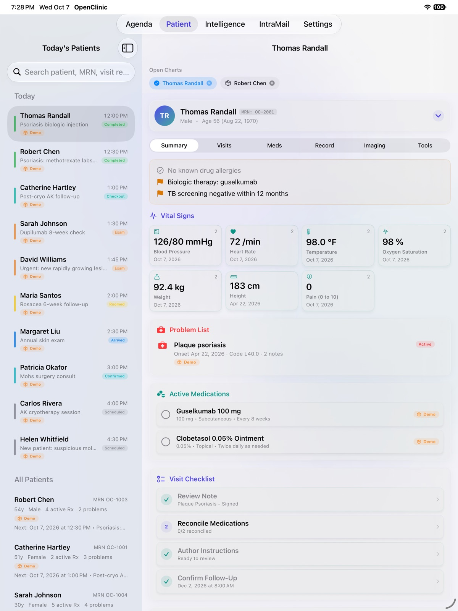
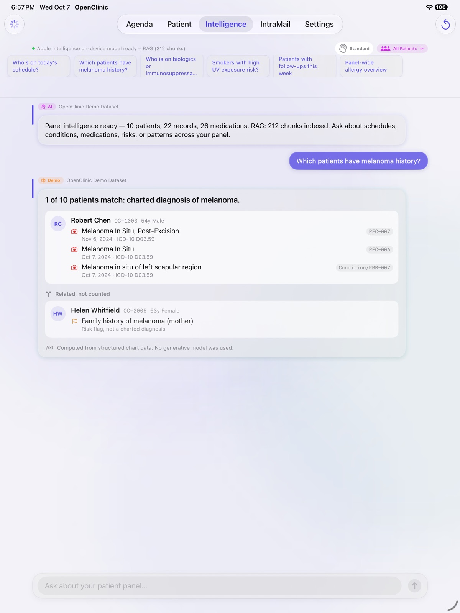
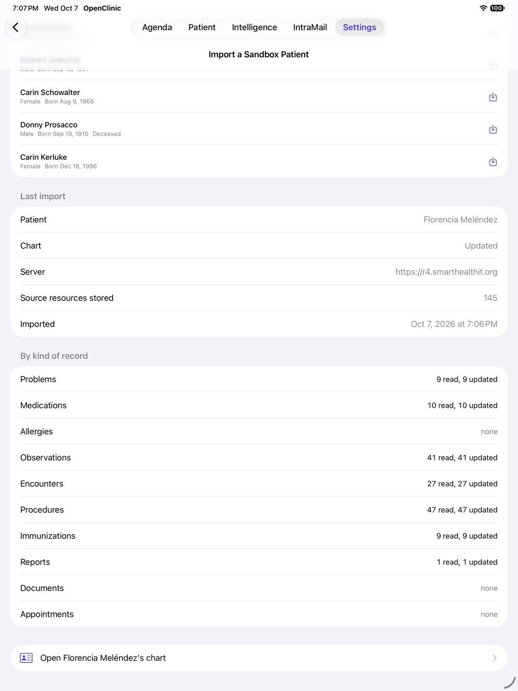
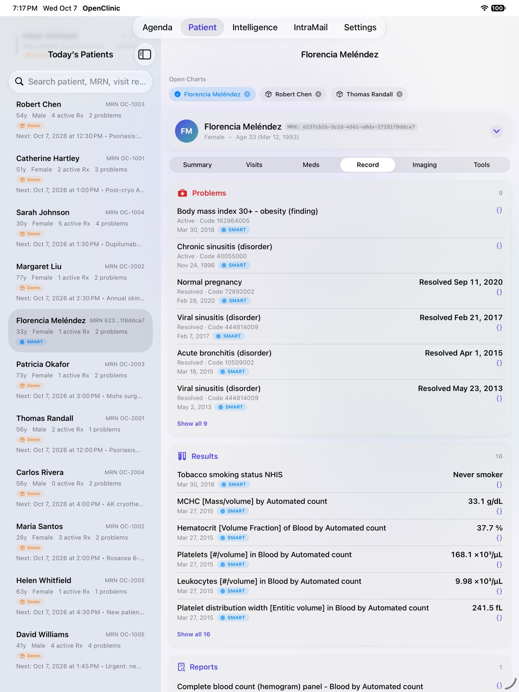
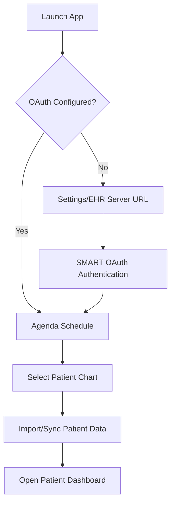
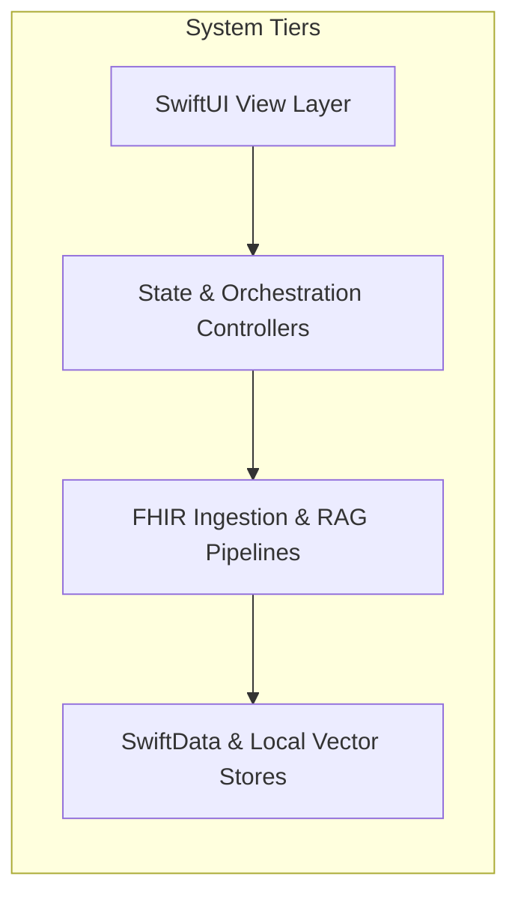
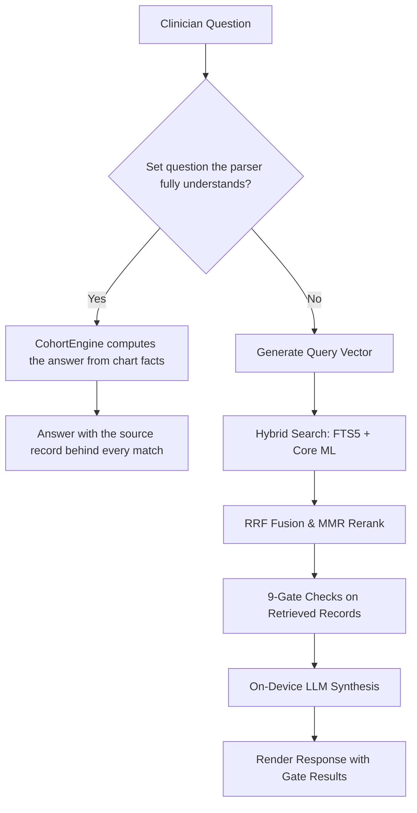
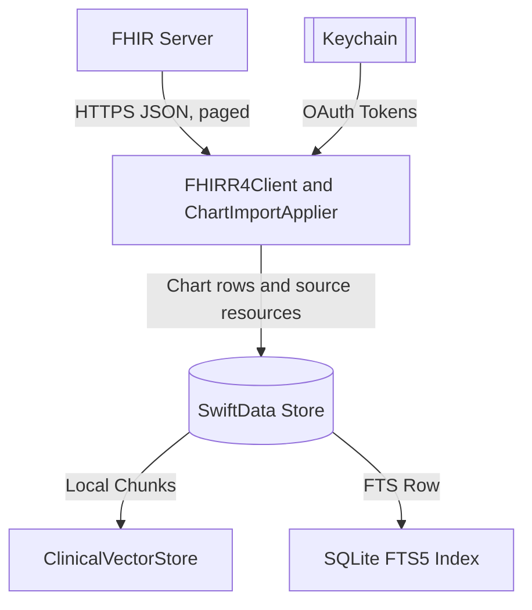

# OpenClinic

<p align="center">
  
</p>

<p align="center">
  <strong>A provider-facing clinical workspace prototype for patient charting, SMART on FHIR import, and on-device clinical intelligence.</strong>
</p>

<p align="center">
  
  
  
</p>

---

## Overview

OpenClinic is a native iOS, iPadOS, and macOS clinical workspace prototype designed for healthcare providers, with a visionOS destination declared in the project. It integrates patient schedules, clinical record logs, visual timelines for dermatological checkups, and a SMART on FHIR synchronization pipeline into a unified SwiftUI experience that keeps chart state local on device.

* **Functional Role:** Aggregates patient demographic profiles, clinical record timelines, medication lists, appointments, and photos.
* **Clinician Workflow:** Provides offline-capable charting, record lookups, and note completion tools while keeping PHI inside the device sandbox except when explicitly pulling records from configured SMART on FHIR servers and during dictation, which Apple's Speech framework transcribes, so audio may go to Apple.
* **On-Device LLMs & RAG:** Implements a local retrieval-augmented generation (RAG) pipeline to support chart Q&A, clinical note compilation, and documentation checks without transmitting Patient Health Information (PHI) to third-party cloud APIs.
* **Engine Lineage:** The clinical retrieval stack adapts OpenIntelligence internals for Core ML embeddings, token budgeting, retrieval shaping, and verification, then specializes those paths for patient-scoped clinical use.
* **EHR Integration:** Connects to standard EHR sandbox platforms using SMART on FHIR OAuth scopes to import multi-patient records.
* **Product Boundary:** OpenClinic is a prototype and design exploration. It is not approved for live clinical deployment and should not be presented as a production EHR replacement.

---

## Product Snapshot

| Dimension | Detail |
|---|---|
| Platform | iOS / iPadOS / macOS / visionOS |
| Language | Swift |
| UI | SwiftUI |
| Architecture | Container-driven / Actor-isolated RAG |
| Primary APIs | Apple Foundation Models (`LanguageModelSession`), SMART on FHIR, Core ML |
| Storage | SwiftData, SQLite FTS5, Keychain |
| Status | Prototype |
| License | Proprietary / None |

---

## Screenshots

Everything shown is synthetic: the bundled demo panel, or Synthea patients read from the open SMART Health IT R4 sandbox.

| | |
|---|---|
|  |  |
| Chart summary: allergies and flags, vital signs from stored observations, the problem list, active medications. | A panel question answered by code from chart facts, each match shown with its sources. |
|  |  |
| A full-record import from the sandbox, counted by kind of record. | The imported record. Each row opens the FHIR resource it was read from. |

---

## Key Capabilities

- **On-Device LLM Integration:** Apple's Speech framework transcribes dictations (audio may go to Apple), and local Apple Foundation Models (`LanguageModelSession`) turn the transcripts into structured notes (`ClinicalVisitNote`). The model declines some requests; the app then lists the patient's own chart rows, or sorts the dictation's own sentences into the note's sections (`DictationSorter`, which adds no finding, plan or order), and labels the text as written by the app.
- **Local Vector Search:** Generates 384-dimensional embeddings (MiniLM-L6-v2) using a bundled Core ML model, indexing chunks in a local vector database.
- **Computed Panel Answers:** A set question such as "which patients have melanoma history" is parsed into a structured query and computed from chart facts by `CohortEngine`, with the record, prescription, or appointment behind every match. No language model takes part, and a question the parser does not fully understand is not computed.
- **9-Gate Retrieval Checks:** Scores the retrieved records on nine checks before the model runs and shows the results with the answer. The checks do not read or block generated text. Model-written answers are labeled as unchecked in the app.
- **FHIR Interoperability:** Imports a patient's full record from a FHIR R4 server: Patient plus Condition, MedicationRequest, AllergyIntolerance, Observation, Encounter, Procedure, Immunization, DiagnosticReport, DocumentReference, and Appointment, with paging and retries. Servers that need authorization use SMART on FHIR through `ASWebAuthenticationSession`; the open SMART Health IT sandbox imports with no sign-in.
- **Source Fidelity:** Every imported resource is stored as the server sent it, beside the chart row mapped from it; the one change is that a Patient's government numbers (Social Security, driver's license, passport, Medicare, Medicaid, tax) lose their values before storage: in an identifier anywhere in the resource, in any other value equal to one, and in the text of the narrative. A row the server stops returning is marked, never deleted, and a failed search is never read as an empty chart.
- **Data Provenance:** Attaches sync timestamps and source system attributes to SwiftData entities to preserve the authority of remote records.
- **OpenIntelligence-Derived Retrieval Internals:** Reuses and adapts embedding, full-text, boosting, and verification patterns from OpenIntelligence, but applies them to patient-scoped clinical workflows instead of general document Q&A.
- **Main-Thread Concurrency:** Isolates database inserts, vector queries, and full-text indexing inside background Actors.

---

## How It Works

This flowchart details the clinician onboarding, patient navigation, and database sync workflow:


```mermaid
flowchart TD
    A[Launch App] --> B{OAuth Configured?}
    B -->|No| C[Settings/EHR Server URL]
    B -->|Yes| D[Agenda Schedule]
    C --> E[SMART OAuth Authentication]
    E --> D
    D --> F[Select Patient Chart]
    F --> G[Import/Sync Patient Data]
    G --> H[Open Patient Dashboard]
```

On launch, OpenClinic seeds a baseline configuration and sets up the local SwiftData model container. Clinicians select patients from a daily schedule timeline. If connected to a SMART on FHIR server, the client queries and resolves patient records locally on demand.

---

## Architecture

OpenClinic organizes components into distinct functional layers:


```mermaid
flowchart LR
    subgraph Layers ["System Tiers"]
        UI[SwiftUI View Layer] --> Controllers[State & Orchestration Controllers]
        Controllers --> Ingestion[FHIR Ingestion & RAG Pipelines]
        Ingestion --> Storage[SwiftData & Local Vector Stores]
    end
```

*For a detailed view-by-view diagram covering controllers, services, and local file storage, refer to [ARCHITECTURE.md](ARCHITECTURE.md#2-system-layer-diagram).*

---

## Core Workflows

A panel question is computed from chart facts when the parser fully understands it. Every other question goes through a hybrid vector-lexical lookup and checks on the retrieved records:


```mermaid
flowchart TD
    A[Clinician Question] --> P{Set question the parser fully understands?}
    P -->|Yes| Q[CohortEngine computes the answer from chart facts]
    Q --> R[Answer with the source record behind every match]
    P -->|No| B[Generate Query Vector]
    B --> C[Hybrid Search: FTS5 + Core ML]
    C --> D[RRF Fusion & MMR Rerank]
    D --> F[9-Gate Checks on Retrieved Records] --> E[On-Device LLM Synthesis] --> H[Render Response with Gate Results]
```

*For details on chunking parameters, cross-encoders, and reciprocal rank fusion, refer to [ARCHITECTURE.md](ARCHITECTURE.md#7-core-retrieval-rag-pipeline).*

---

## Data Flow

This diagram traces the local storage boundaries and data synchronization paths:


```mermaid
flowchart TD
    FHIR[FHIR Server] -->|HTTPS JSON, paged| Import[FHIRR4Client and ChartImportApplier]
    Import -->|Chart rows and source resources| SD[(SwiftData Store)]
    SD -->|Local Chunks| VectorStore[ClinicalVectorStore]
    SD -->|FTS Row| FTS[SQLite FTS5 Index]
    Keychain[[Keychain]] -->|OAuth Tokens| Import
```

---

## File Entry Points

| Concern | Files | Responsibility |
|---|---|---|
| **App Entry** | [OpenClinicApp.swift](OpenClinic/OpenClinicApp.swift) | Bootstrapping the SwiftData schema, UserDefaults migrations, and launch-time RAG index triggers. |
| **Main UI Shell** | [ContentView.swift](OpenClinic/ContentView.swift) | Hosts the main shell. |
| **Patient Chart UI** | [PatientDashboardView.swift](OpenClinic/Views/PatientDashboardView.swift) | Primary clinical layout displaying demographics, visit history, medication lists, and visual timelines. |
| **Encounter Workspace** | [ClinicalExamView.swift](OpenClinic/Views/ClinicalExamView.swift) | Dictation transcription and structured note generation interface for clinicians. |
| **Intelligence UI** | [ClinicIntelligenceView.swift](OpenClinic/Views/ClinicIntelligenceView.swift) | Console UI for executing patient-specific or panel-wide local AI queries. |
| **OAuth Connection** | [SMARTConnectionController.swift](OpenClinic/Interop/SMART/SMARTConnectionController.swift) | Handles authorization endpoint discovery, JWT decoding, and token renewal. |
| **FHIR Read Layer** | [FHIRR4Client.swift](OpenClinic/Interop/FHIR/R4/FHIRR4Client.swift), [FHIRR4ChartMapper.swift](OpenClinic/Interop/FHIR/R4/FHIRR4ChartMapper.swift) | Paging HTTP client and the pure mapping from FHIR R4 resources to plain chart values. |
| **Chart Import** | [ChartImportApplier.swift](OpenClinic/Interop/Import/ChartImportApplier.swift) | Applies an imported record to the store in one transaction and keeps each source resource. |
| **RAG Orchestrator** | [ClinicalRAGService.swift](OpenClinic/RAG/ClinicalRAGService.swift) | Coordinates embeddings, FTS5 keywords, hybrid rankings, and verification gates. |
| **Retrieval Checks** | [VerificationGates.swift](OpenClinic/RAG/VerificationGates.swift) | Implements the 9-gate checks that score the retrieved records for grounding, completeness, and HIPAA isolation before the model runs. |
| **Computed Panel Answers** | [CohortEngine.swift](OpenClinic/Intelligence/CohortEngine.swift), [CohortQuery.swift](OpenClinic/Intelligence/CohortQuery.swift) | Parses set questions into structured queries and computes the matching patients with the chart facts behind each match. |
| **Demo Panel** | [DemoPanel.json](OpenClinic/Resources/Demo/DemoPanel.json), [DemoDataSeeder.swift](OpenClinic/Demo/DemoDataSeeder.swift) | The synthetic ten-patient panel and the code that seeds it and keeps today's schedule current. |

---

## Configuration

These environment configurations control OpenClinic's local storage and sync behavior:

| Setting | Storage | Default | Required | Purpose |
|---|---|---|---|---|
| **EHR Server Presets** | `UserDefaults` | `https://launch.smarthealthit.org/v/r4/fhir` | Yes | Endpoint base URL for SMART discovery and patient downloads. |
| **SMART Client ID** | `UserDefaults` | `medmod-ios-public` | Yes | Public application registration identifier on the EHR server. |
| **Redirect Scheme** | `Info.plist` | `medmod://smart-callback` | Yes | Callback schema mapping for ASWebAuthenticationSession redirection. |
| **RAG Embedding Model** | Local Directory | `EmbeddingModel.mlpackage` | Yes | Core ML package path for text embedding generation. |
| **Token Vocabulary** | Local Directory | `embedding_vocab.json` | Yes | Token mapping file for the clinical text chunker. |
| **Demo Panel Version** | `UserDefaults` | `demoPanelVersion`, `demoTimelineDay` | No | Records which fixture version is seeded and which day today's schedule was built for. |

---

## Build & Run

### Prerequisite Toolchain
* macOS 27.0+ or compatible development workstation.
* **Xcode 27.0** (the build verified on 2026-10-07) with the iOS 27.0 and macOS 27.0 SDKs. Deployment targets are iOS 26.2 and macOS 26.2.
* Apple Developer Account configured in Xcode for physical device testing.

### Setup Instructions
```bash
# Clone the repository
git clone https://github.com/Gunnarguy/OpenClinic.git
cd OpenClinic

# Open the project in Xcode
open OpenClinic.xcodeproj
```

1. Select the `OpenClinic` target in the scheme editor.
2. Under **Signing & Capabilities**, select your developer team and update the bundle identifier if compiling for a physical device.
3. Choose a simulator (e.g. iPad Pro running iOS 26.2) or select a connected Apple device.
4. Press `Cmd + R` to compile and run. On launch, the app will seed clinical demo records and start the local vector indexer.

---

## Testing

One command runs the unit tests and then an iOS Simulator build:

```bash
./Scripts/verify.sh          # tests on the macOS host, then the iOS Simulator build
./Scripts/verify.sh tests    # tests only
./Scripts/verify.sh build    # iOS Simulator build only
```

The script refuses to run when iCloud conflict copies are in the tree or less than 4 GB of disk is free, and it writes build products outside the repository.

| Suite | What it holds the code to |
|---|---|
| `PanelQuestionEvalTests` | 31 panel questions in plain language, each scored against a patient set written by hand from the demo fixture. A case passes only on an exact set match. |
| `CohortEngineTests` | Parser and engine behavior on a hand-built panel, including the questions the parser must refuse. |
| `DemoPanelTests`, `DemoChartRowsTests` | The demo fixture is coherent (ages against dates of birth, zones, ICD-10 format, vitals only for roomed visits, lab values that agree with the inbox) and the seeder never duplicates rows or undoes a clinician's edit. |
| `FHIRR4*Tests` | The FHIR R4 read layer against responses captured from the SMART Health IT sandbox: paging, retries, a refused cross-host paging link, entered-in-error resources left out. |
| `ChartImportApplierTests`, `ChartModelPersistenceTests` | A captured sandbox record through the mapper and into the store: importing twice changes nothing, a row the server stops returning is kept and marked, a failed or truncated search removes nothing, and every model saves. |
| `ProblemListTests` | The problem list a chart shows: charted problems, then diagnoses only a note names, with examination visits (ICD-10-CM Z00 to Z13) left off. |
| `SMARTSessionTests` | A callback with a missing or wrong `state` is refused, an authorization error is reported in the server's words, the scopes cover every resource type the import reads, `launch` is asked for only with a launch token, a token request follows no redirect, discovery follows none to another server, and `offline_access` is asked for only where the server offers refresh tokens. |
| `SMARTLiveSignInTests` | Opt-in (`./Scripts/verify.sh live`): the app's own sign-in code against the SMART Health IT launcher, including a wrong PKCE verifier that the server must refuse. |
| `ClinicalIndexSyncTests`, `ClinicalVectorStoreTests` | The plan the launch index sync follows embeds only new text and keeps the vector of a chunk that only moved, and a stale file is never merged into a rebuilt index. The sync itself (`syncIndex`) is checked by the device self-check, not by a unit test. |
| `ChartDateTextTests` | A date the source stated only to the year or month is written that way. |
| `ClinicalIntelligenceServiceTests`, `VisitNoteTextTests` | Text the app lists or fills in is reported as that and never as model-written (on screen, in a Shortcut's dialog and in a saved note's source kind), a model call is given up on at its time limit, and the plain-text form of a note reads back into its sections. |
| `ClinicalChunkerTests`, `ClinicalFTSServiceTests`, `SMARTCredentialStoreTests`, others | Chunking, FTS5 search and its injection guard, Keychain credential storage, anatomical regions, patient education links. |

Checks that still need a person and a device:

| Check | Procedure | Expected result |
|---|---|---|
| **SMART sign-in sheet** | Settings -> Live EHR Import -> SMART R4 Preset -> Connect | The system sign-in sheet appears, authorizes, and the record imports. The protocol under the sheet (discovery, PKCE, token exchange, authorized read, refresh) is checked by `./Scripts/verify.sh live`. |
| **Model-written answers on screen** | Ask a free-form question about one patient in the Intelligence tab on a device with Apple Intelligence | An answer labeled as written by the on-device model, with the retrieved sources under it. `./Scripts/verify.sh device` times one such answer without the screen. |

Two more modes of the script reach outside the Mac and are not part of the default run:

```bash
./Scripts/verify.sh live      # a real SMART on FHIR sign-in against launch.smarthealthit.org (synthetic patients, no password)
./Scripts/verify.sh device    # build, install and self-check on a connected, unlocked iPhone or iPad
```

---

## Privacy & Security

OpenClinic keeps chart data on the doctor's device, although dictation audio may go to Apple's speech service. No clinical data is synced to third-party databases:
* **Encryption at Rest:** SwiftData sqlite files inherit default Apple sandbox encryption.
* **Credentials Storage:** SMART tokens, client secrets, and session parameters are kept in the OS Keychain.
* **Log Privacy:** System log statements (`os.Logger`) redact patient names and medical record numbers.

For more details, see [PRIVACY.md](PRIVACY.md) and [SECURITY.md](SECURITY.md).

---

## Documentation

| Document | Purpose |
|---|---|
| [Architecture](ARCHITECTURE.md) | System design, data flow, and service boundaries |
| [Security](SECURITY.md) | Secret handling, local storage, and release checks |
| [Privacy](PRIVACY.md) | Data storage, API transmission, and user controls |
| [Roadmap](ROADMAP.md) | Current status, planned work, and known gaps |
| [Case Study](docs/CASE_STUDY.md) | Engineering retrospective and implementation notes |

---

## Roadmap

### Completed Milestones
- [x] SwiftData core models mapping patient charts, clinical notes, medications.
- [x] On-device vector store and SQLite FTS5 search indexers.
- [x] 9-Gate retrieval checks scoring the retrieved records before the model runs.
- [x] Computed panel answers with a hand-written evaluation set.
- [x] SMART on FHIR OAuth discovery and patient record import flows.
- [x] Reciprocal Rank Fusion (RRF) and MMR search candidate balancing.
- [x] Multi-platform UI Unification and iOS / iPadOS / macOS / visionOS Support.
- [x] Integration of RAG Evaluation and XCTest Suites.

### In Progress
- [ ] Enhancing multi-pass Deep Think query extraction heuristics.
- [ ] Optimizing Core ML inference times on older Apple Silicon devices.
- [ ] Transitioning visionOS build targets to spatial multi-window environments.

### Planned / Backlog
- [ ] Outbound writebacks to FHIR servers (e.g. uploading signed notes).
- [ ] Full-body anatomical mesh mapping in 3D for spatial tracking.

---

## License

No license has been applied to this repository yet. Contact the repository owner before copying, modifying, or redistributing these source materials.
