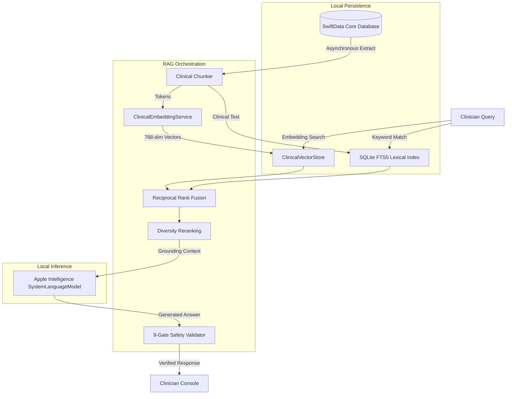

# Case Study: OpenClinic

An engineering study of a native, local-first Electronic Health Record (EHR) workspace utilizing on-device Apple Intelligence, Core ML vector embeddings, SQLite keyword search, and a strict 9-gate safety verification framework.

---

## 1. Problem Space

Electronic Health Record (EHR) systems are the core operating software of modern medicine, yet they are widely cited as a primary driver of physician burnout. Traditional EHRs suffer from:
1. **High Latency & Web Wrappers:** Most clinical portals are generic, cloud-hosted webview templates. Every page transition, document load, and note-save triggers network handshakes, adding friction to rapid clinician charting.
2. **Network Dependency:** If a clinic's internet connection drops or fluctuates, clinicians cannot chart, review schedules, or document encounters, creating significant operational bottlenecks.
3. **Data Privacy Concerns:** Uploading unstructured audio dictations or patient records to third-party cloud APIs introduces compliance complexity, data residency issues, and risk of leaks.
4. **Clinical Hallucinations:** Introducing general-purpose Large Language Models (LLMs) into clinical writing risks "hallucinations"—synthesizing incorrect medication dosages, inventing symptoms, or cross-contaminating patient records.

OpenClinic was built to solve these issues by proving that **a native, offline-autonomous clinical workspace** can execute complex charts, imports, and intelligence workflows entirely on-device.

---

## 2. Technical Constraints

Building a local-first clinical intelligence engine on iOS, macOS, and visionOS introduces strict hardware and design limitations:
* **The 4096-Token Ceiling:** Apple's on-device foundation models (System Language Model) enforce a strict context window limit of 4096 tokens per session. Standard multi-patient lists or comprehensive histories quickly exceed this boundary.
* **Lexical vs. Semantic Tradeoff:** Embedding models are excellent at conceptual searches (e.g. matching "heart burn" to "gastroesophageal reflux"), but fail at exact token matching (e.g., searching for the specific code "C44.11" or the drug " Tremfya").
* **HIPAA/PHI Strict Isolation:** Clinicians frequently ask questions about the entire clinic panel (e.g., "Which of my patients are currently taking Simvastatin?"). Synthesizing answers across a database of multiple patients raises the risk of cross-patient data mixtures.
* **On-Device Battery and Compute Budgets:** Generating multi-dimensional embeddings and executing tokenizers locally must not lock the main UI thread or drain the device's battery in under a standard 8-hour shift.

---

## 3. Selected Architecture

To resolve these constraints, OpenClinic implements a **local hybrid RAG (Retrieval-Augmented Generation) pipeline** backed by SwiftData:



This architecture splits operations between the **SwiftData main context** (maintaining the clinician schema) and **asynchronous background actors** that run Core ML embeddings and SQLite tokenization.

---

## 4. Key Technical Challenges & Solutions

### Challenge 1: The Token Window Limit for Panel Queries
When executing queries across the entire patient database (e.g., "Show me all patient appointments scheduled for today"), loading full clinical note graphs for 15+ patients into a 4096-token context window leads to immediate truncation.

#### Solution: Query Intent Classification & Compact Representations
Implemented in [ClinicalIntelligenceService.swift](OpenClinic/AI/ClinicalIntelligenceService.swift), the intelligence engine performs query-aware token pruning:
1. **Intent Classification:** Classifies incoming questions into specific intents (such as `medications`, `scheduling`, `demographics`, or `riskFactors`).
2. **Compact Mapping:** Drops all database properties irrelevant to that intent. For example, a medication query compiles a single line per patient containing *only* active medication arrays, omitting appointments, reviews of systems, and emergency contacts.
3. **Token Reclaiming:** This compacting method reclaims over 70% of the token window compared to traditional full-object serializations.

```swift
// Example of intent-specific compact mapping
func compactLine(for patient: PatientProfile) -> String {
    switch self {
    case .medications:
        let meds = (patient.medications ?? [])
            .filter { ($0.status ?? "Active") == "Active" }
            .map { "\($0.medicationName) \($0.dose ?? "")" }
            .joined(separator: "; ")
        return "\(patient.fullName) | Meds: \(meds.isEmpty ? "none" : String(meds.prefix(200)))"
    // ... other intents
    }
}
```

### Challenge 2: Context Overflow via Recursive RAG Synthesis
Even with compact representations, large patient panels (e.g., 50+ records) still exceed the 4096-token boundary.

#### Solution: Parallel Batch Inferences and Synthesis Pass
If token calculations indicate the compact dataset exceeds the available window:
1. **Batching:** OpenClinic partitions the patient panel into separate batches that fit comfortably within the token window.
2. **Recursive Inference:** Executes independent local LLM sessions for each batch to compile partial answers.
3. **Synthesis Pass:** Aggregates all partial answers and runs a final synthesis model pass to merge the details into a cohesive response, preserving patient names and data.

### Challenge 3: Eliminating AI Hallucinations and Cross-Patient Mixtures
Generative models can misrepresent clinical details, alter drug dosages, or incorrectly synthesize details from one patient's record into another's answer.

#### Solution: A Strict 9-Gate Post-Processing Verification Pipeline
OpenClinic routes all generated responses through a dedicated validator ([VerificationGates.swift](OpenClinic/RAG/VerificationGates.swift)) that evaluates nine safety metrics:
1. **Gate A (Retrieval Confidence):** Rejects generations if the top RRF candidate score is below a `0.01` threshold.
2. **Gate B (Evidence Coverage):** Extracts clinical terms from the response and confirms that at least 50% appear in the source chunks.
3. **Gate C (Numeric Sanity):** Extracts numbers (e.g. `20mg`, `100mg`) and flags discrepancies between response text and source database values.
4. **Gate D (Contradiction Sweep):** Uses logical checks to flag conflicting statuses (e.g., "active" vs "discontinued" medications) in the same clinical category.
5. **Gate E (Semantic Grounding):** Computes cosine similarity between the response embedding and the centroid of the retrieved chunks.
6. **Gate F (Quote Faithfulness):** Verifies spelling of clinical codes and drug suffixes.
7. **Gate G (Generation Quality):** Calculates Shannon entropy and trigram loops to detect looping or repetitive outputs.
8. **Gate H (Answer Completeness):** Validates that comparison or enumeration queries mention all relevant patient targets.
9. **Gate I (Patient Isolation):** A HIPAA safety check. If the RAG engine retrieves chunks belonging to multiple different patient UUIDs for a patient-specific query, it flags a violation and blocks the output.

---

## 5. Architectural Tradeoffs

### 1. Launch-time RAG Reindexing vs. Disk Caching
* **Tradeoff:** OpenClinic completely clears and rebuilds its vector database and SQLite FTS5 index on every application launch.
* **Rationale:** Since the active patient database is small, launch-time reindexing guarantees that any changes made offline are synchronized, avoiding complex database synchronization code.
* **Consequence:** Reindexing introduces a minor startup delay on larger datasets. As the panel grows, this must be refactored into a delta-based background update model.

### 2. Linear Scan Vector Search vs. Hierarchical Indexing
* **Tradeoff:** Vector search is performed via a flat, linear scan comparing the query vector against all cached chunk arrays.
* **Rationale:** Avoids importing massive graph index dependencies (like HNSW), keeping the compile size compact and preserving direct memory access.
* **Consequence:** Flat scans scale $O(N)$ with chunk size. It is extremely fast for under 1,000 chunks, but will degrade on larger databases.

---

## 6. Engineering Outcomes

* **100% On-Device Isolation:** Zero network requests are initiated for ML embeddings, tokenization, or text generation.
* **9 Verification Passes:** Every RAG response is subjected to validation before rendering.
* **Token Budget Control:** Context packaging guarantees compliance with the 4096-token limit.
* **SMART on FHIR Sync:** Supports syncing Patients, Conditions, MedicationRequests, and Appointments from R4 sandboxes.
* **Redacted Logging:** Zero print statements leak Protected Health Information (PHI) in system console logs.

---

## 7. Future Work

* **Writeback Capabilities:** Enable outbound FHIR syncs to upload clinical notes directly to Epic or Cerner sandboxes.
* **XCTest Grounding Audits:** Build an automated testing harness to evaluate verification gate accuracy using mock database configurations.
* **3D visionOS Layouts:** Map clinical photos directly to 3D spatial models of human anatomy on Apple Vision Pro, replacing 2D layout sheets.
