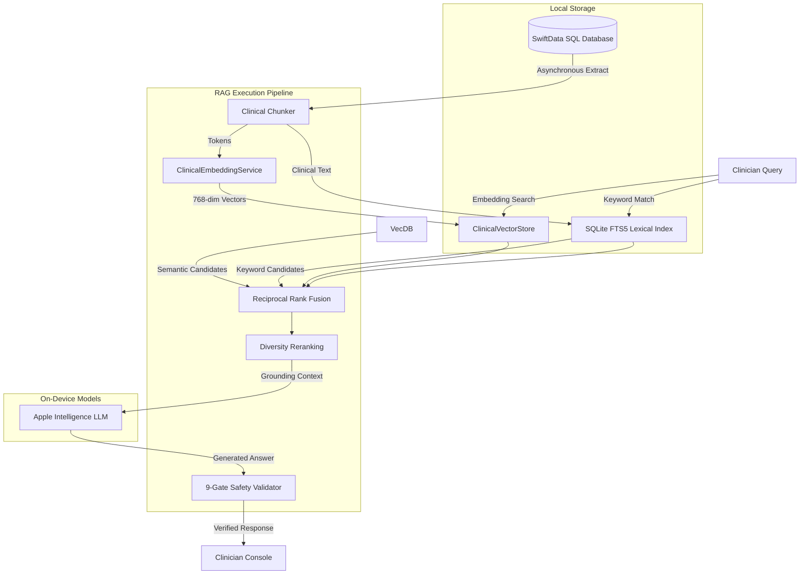

# Technical Design Review: OpenClinic

An engineering analysis of a native clinical workspace prototype utilizing on-device Apple Intelligence, Core ML vector embeddings, SQLite keyword search, and a 9-gate safety verification framework.

---

## 1. Problem Space

Electronic Health Record (EHR) systems are the core operational software of healthcare environments, but they commonly face the following technical limitations:
1. **High Latency Web Clients:** Many clinical systems are built as cloud-hosted web wrappers. Page transitions, document loading, and note completion events trigger multiple network roundtrips, introducing lag.
2. **Network Dependency:** If a clinic's internet connection drops or fluctuates, clinicians lose access to charting, schedule navigation, and note verification tools.
3. **Data Security Risks:** Processing unstructured audio dictations or patient chart profiles using cloud-based API endpoints requires complex HIPAA/GDPR data residency controls.
4. **LLM Hallucinations:** Utilizing general-purpose, non-deterministic Large Language Models (LLMs) in clinical writing risks compiling incorrect medication names or dosages, fabricating symptoms, or mixing patient files.

OpenClinic explores an alternative: **implementing a local-first clinical workspace prototype** that processes charting, data sync, and clinical RAG workflows on the client device.

The retrieval stack is not built in a vacuum. Clinical embeddings, retrieval shaping, and verification patterns are adapted from OpenIntelligence and then specialized for patient-scoped clinical safety.

---

## 2. Technical Constraints

Building a local retrieval and reasoning pipeline on iOS, macOS, and visionOS introduces strict engineering boundaries:
* **The 4096-Token Ceiling:** Apple's on-device foundation models (`SystemLanguageModel`) enforce a strict context window limit of 4096 tokens per session. Compiling multi-patient records or comprehensive histories easily overflows this limit.
* **Lexical vs. Semantic Tradeoff:** Embedding models retrieve content based on conceptual similarity (e.g. matching "heart burn" to "GERD"), but struggle with exact code matching (e.g., locating the precise ICD-10 code "C44.11" or the medication "Tremfya").
* **Patient Data Isolation:** Clinicians query panel data across multiple patients (e.g., "Which patients are scheduled for biopsy today?"). Synthesizing answers across a database of patient records increases the risk of cross-patient data leaks.
* **Client Device Compute Limits:** Generating vector embeddings and executing tokenization locally must run asynchronously to prevent blocking the main SwiftUI thread.

---

## 3. Implemented RAG Architecture

To resolve these constraints, OpenClinic coordinates a local hybrid RAG pipeline backed by SwiftData:

This design separates user-facing UI state on the main actor from background data transformations, vector lookups, and tokenization.

---

## 4. Key Challenges & Solutions

### Challenge 1: Compressing Context for Panel-Wide Queries
When querying across the entire patient database (e.g., compiling active medications across today's scheduled list), loading the complete notes graph for 15+ patients will overflow the 4096-token window.

#### Solution: Query-Intent Classification and Property Compacting
The intelligence engine performs query-aware context pruning:
1. **Intent Classification:** Classifies incoming questions into specific intents (such as `medications`, `scheduling`, `demographics`, or `riskFactors`).
2. **Property Compacting:** Maps the query to only the SwiftData properties required. For example, a medication query compiles a single line per patient containing *only* active medication arrays, completely dropping appointments, reviews of systems, and emergency contact details.
3. **Token Conservation:** This compacting method reduces token consumption by over 70% compared to serializing the entire patient object graph.

### Challenge 2: Context Overflow via Recursive RAG Synthesis
When the patient dataset exceeds the token window even after compacting, the system requires a multi-pass synthesis method.

#### Solution: Parallel Batch Inferences and Synthesis Pass
If token calculations indicate the compact dataset exceeds the available window:
1. **Batching:** OpenClinic partitions the patient panel into separate batches that fit comfortably within the token window.
2. **Recursive Inference:** Executes independent local LLM sessions for each batch to compile partial answers.
3. **Synthesis Pass:** Aggregates all partial answers and runs a final synthesis model pass to merge the details into a cohesive response, preserving patient names and data.

### Challenge 3: Eliminating AI Hallucinations and Cross-Patient Mixtures
Generative models can misrepresent clinical details, alter drug dosages, or incorrectly synthesize details from one patient's record into another's answer.

#### Solution: A Strict 9-Gate Post-Processing Verification Pipeline
OpenClinic routes all generated responses through a dedicated validator ([VerificationGates.swift](OpenClinic/RAG/VerificationGates.swift)) that evaluates nine safety metrics:
1. **Gate A (Retrieval Confidence):** Rejects generations if the top RRF candidate score is below a `0.01` threshold.
2. **Gate B (Evidence Coverage):** Extracts clinical terms from the response and confirms that at least 50% appear in the source chunks.
3. **Gate C (Numeric Sanity):** Extracts numbers (e.g. `20mg`, `100mg`) and flags discrepancies between response text and source database values.
4. **Gate D (Contradiction Sweep):** Uses logical checks to flag conflicting statuses (e.g., "active" vs "discontinued" medications) in the same clinical category.
5. **Gate E (Semantic Grounding):** Computes cosine similarity between the response embedding and the centroid of the retrieved chunks.
6. **Gate F (Quote Faithfulness):** Verifies spelling of clinical codes and drug suffixes.
7. **Gate G (Generation Quality):** Calculates Shannon entropy and trigram loops to detect looping or repetitive outputs.
8. **Gate H (Answer Completeness):** Validates that comparison or enumeration queries mention all relevant patient targets.
9. **Gate I (Patient Isolation):** A HIPAA safety check. If the RAG engine retrieves chunks belonging to multiple different patient UUIDs for a patient-specific query, it flags a violation and blocks the output.

---

## 5. Architectural Tradeoffs

### 1. Launch-time RAG Reindexing vs. Disk Caching
* **Tradeoff:** OpenClinic clears and rebuilds its vector database and SQLite FTS5 index on every application launch.
* **Rationale:** Since the active patient database is small, launch-time reindexing guarantees that any changes made offline are synchronized, avoiding complex database synchronization code.
* **Consequence:** Reindexing introduces a minor startup delay on larger datasets. As the panel grows, this must be refactored into a delta-based background update model.

### 2. Linear Scan Vector Search vs. Hierarchical Indexing
* **Tradeoff:** Vector search is performed via a flat, linear scan comparing the query vector against all cached chunk arrays.
* **Rationale:** Avoids importing massive graph index dependencies (like HNSW), keeping the compile size compact and preserving direct memory access.
* **Consequence:** Flat scans scale $O(N)$ with chunk size. It is extremely fast for under 1,000 chunks, but will degrade on larger databases.

---

## 6. Implementation Outcomes

* **100% On-Device Isolation:** Zero network requests are initiated for ML embeddings, tokenization, or text generation.
* **9 Verification Passes:** Every RAG response is subjected to validation before rendering.
* **Token Budget Control:** Context packaging guarantees compliance with the 4096-token limit.
* **SMART on FHIR Sync:** Supports syncing Patients, Conditions, MedicationRequests, and Appointments from R4 sandboxes.
* **Redacted Logging:** Zero print statements leak Protected Health Information (PHI) in system console logs.
